# 🎗️ Kibo - System Architecture

## High-Level Overview

```mermaid
graph TB
    subgraph "Client/Frontend"
        WEB[Web App Next.js]
        WALLET[Wallet Integration<br/>Privy]
    end

    subgraph "Backend Services"
        API[Next.js API Routes]
        AUTH[Authentication Service]
        ORDER[Orders Service]
        QUOTE[Quote Service]
        ESCROW[Escrow Service]
        CRON[Serverless Cron Jobs]
    end

    subgraph "Storage"
        DB[(Supabase PostgreSQL)]
        STORAGE[Supabase Storage]
        REALTIME[Supabase Realtime]
    end

    subgraph "External Services"
        PRICE_API[Price API<br/>binance_api/coingecko]
        QR_SCAN[QR Scanner<br/>HTML5]
        BLOCKCHAIN[Mantle Network<br/>USDT]
    end

    subgraph "Users"
        USER[👤 User]
        ALLY[🤝 Ally]
        ADMIN[👨‍💼 Admin]
    end

    %% Main Connections
    USER --> WEB
    ALLY --> WEB
    ADMIN --> WEB
    
    WEB --> API
    WALLET --> WEB
    
    API --> AUTH
    API --> ORDER
    API --> QUOTE
    API --> ESCROW
    
    CRON --> ORDER
    CRON --> QUOTE
    
    ORDER --> DB
    QUOTE --> DB
    ESCROW --> DB
    AUTH --> DB
    
    ORDER --> STORAGE
    ORDER --> REALTIME
    
    QUOTE --> PRICE_API
    WEB --> QR_SCAN
    ESCROW --> BLOCKCHAIN
    
    %% Styles
    classDef frontend fill:#e1f5fe
    classDef backend fill:#f3e5f5
    classDef storage fill:#e8f5e8
    classDef external fill:#fff3e0
    classDef users fill:#fce4ec
    
    class WEB,WALLET frontend
    class API,AUTH,ORDER,QUOTE,ESCROW,CRON backend
    class DB,STORAGE,REALTIME storage
    class PRICE_API,QR_SCAN,BLOCKCHAIN external
    class USER,ALLY,ADMIN users
```

## Component Architecture

```mermaid
graph TB
    subgraph "🖥️ Frontend Layer (Next.js)"
        HOME[🏠 Landing Page]
        USER_DASH[👤 User Dashboard]
        ALLY_DASH[🤝 Ally Dashboard]
        ADMIN_DASH[👨‍💼 Admin Panel]
        QR_COMP[📱 QR Scanner Component]
        WALLET_COMP[🔗 Wallet Connect Component]
    end

    subgraph "⚙️ Backend API (Next.js API Routes)"
        AUTH_API[🔐 /api/auth/*]
        ORDER_API[📋 /api/orders/*]
        QUOTE_API[💱 /api/quote]
        ADMIN_API[⚙️ /api/admin/*]
        UPLOAD_API[📤 /api/upload]
        CRON_API[⏰ /api/cron/*]
    end

    subgraph "🏗️ Services Layer"
        ORDER_SVC[📋 Order Service<br/>• Create/Update Orders<br/>• State Management<br/>• Timeout Handling]
        QUOTE_SVC[💱 Quote Service<br/>• Rate Calculation<br/>• Quote Management<br/>• Price Updates]
        ESCROW_SVC[🏦 Escrow Service<br/>• Fund Management<br/>• Release/Refund<br/>• Blockchain Integration]
        USER_SVC[👤 User Service<br/>• Authentication<br/>• Role Management<br/>• Profile Management]
        NOTIFY_SVC[🔔 Notification Service<br/>• Real-time Updates<br/>• Status Changes<br/>• Push Notifications]
    end

    subgraph "🗄️ Data Layer (Supabase)"
        ORDERS_DB[(📋 orders)]
        USERS_DB[(👤 users)]
        QUOTES_DB[(💱 quotes)]
        ESCROW_DB[(🏦 escrow_accounts)]
        LOGS_DB[(📝 logs)]
        FILES_STORAGE[📁 File Storage<br/>QR Images + Proofs]
        REALTIME_DB[⚡ Realtime Subscriptions]
    end

    %% Frontend → API Connections
    HOME --> AUTH_API
    USER_DASH --> ORDER_API
    ALLY_DASH --> ORDER_API
    ADMIN_DASH --> ADMIN_API
    QR_COMP --> QUOTE_API
    WALLET_COMP --> AUTH_API
    
    %% API → Services Connections
    AUTH_API --> USER_SVC
    ORDER_API --> ORDER_SVC
    QUOTE_API --> QUOTE_SVC
    ADMIN_API --> ORDER_SVC
    UPLOAD_API --> FILES_STORAGE
    CRON_API --> ORDER_SVC
    CRON_API --> QUOTE_SVC
    
    %% Services → Data Connections
    ORDER_SVC --> ORDERS_DB
    ORDER_SVC --> ESCROW_SVC
    ORDER_SVC --> NOTIFY_SVC
    QUOTE_SVC --> QUOTES_DB
    USER_SVC --> USERS_DB
    ESCROW_SVC --> ESCROW_DB
    NOTIFY_SVC --> REALTIME_DB
    
    ORDER_SVC --> LOGS_DB
    ESCROW_SVC --> LOGS_DB
    
    %% Styles
    classDef frontend fill:#e3f2fd
    classDef api fill:#fff8e1
    classDef services fill:#fce4ec
    classDef data fill:#e8f5e8
    
    class HOME,USER_DASH,ALLY_DASH,ADMIN_DASH,QR_COMP,WALLET_COMP frontend
    class AUTH_API,ORDER_API,QUOTE_API,ADMIN_API,UPLOAD_API,CRON_API api
    class ORDER_SVC,QUOTE_SVC,ESCROW_SVC,USER_SVC,NOTIFY_SVC services
    class ORDERS_DB,USERS_DB,QUOTES_DB,ESCROW_DB,LOGS_DB,FILES_STORAGE,REALTIME_DB data
```

## Detailed Tech Stack

## Main Data Flow

```mermaid
sequenceDiagram
    participant U as 👤 User
    participant F as 🖥️ Frontend
    participant API as ⚙️ Next.js API
    participant Q as 💱 Quote Service
    participant E as 🏦 Escrow Service
    participant DB as 🗄️ Supabase
    participant BC as ⛓️ Mantle

    Note over U,BC: MAIN FLOW: User Creates and Pays Order

    U->>F: Scans QR + enters amount BOB
    F->>API: POST /api/quote
    Note right of API: {qrData, amountBOB}
    
    API->>Q: Calculate USDT equivalent
    Q->>DB: Fetch current rate
    DB-->>Q: USDT/BOB rate
    Q-->>API: Calculated USDT amount
    
    API->>DB: Create order (PENDING_PAYMENT)
    Note right of DB: Fixed rate for 3 min
    DB-->>API: Order created with ID
    
    API-->>F: {orderId, amountUSDT, escrowAddress, expiresAt}
    F-->>U: "Pay X USDT within 3 minutes"
    
    Note over F: Countdown timer 3:00
    U->>F: Confirms payment
    F->>U: Privy wallet prompt
    U->>BC: Approves USDT transaction
    
    BC->>E: Webhook: Funds received
    E->>API: Notify confirmed payment
    API->>DB: Update status → AVAILABLE
    DB->>F: Realtime: Order available
    F-->>U: "✅ Payment confirmed. Finding ally..."
```

## API Architecture (Next.js Routes)

```mermaid
graph TB
    subgraph "🔐 Authentication APIs"
        AUTH_CONNECT[POST /api/auth/connect\nConnect wallet via Privy]
        AUTH_PROFILE[GET /api/auth/profile\nGet user profile]
        AUTH_LOGOUT[POST /api/auth/logout\nDisconnect wallet]
    end
    
    subgraph "💱 Quote APIs"
        QUOTE_CREATE[POST /api/quote\nCalculate USDT amount]
        QUOTE_REFRESH[GET /api/quote/:id/refresh\nUpdate expired quote]
        QUOTES_CURRENT[GET /api/quotes/current\nGet current rates]
    end
    
    subgraph "📋 Order Management APIs"
        ORDER_CREATE[POST /api/orders\nCreate new order]
        ORDER_LIST[GET /api/orders\nList user orders]
        ORDER_DETAIL[GET /api/orders/:id\nOrder details]
        ORDER_TAKE[POST /api/orders/:id/take\nAlly takes order]
        ORDER_PROOF[POST /api/orders/:id/proof\nUpload payment proof]
        ORDER_AVAILABLE[GET /api/orders/available\nAvailable for allies]
    end
    
    subgraph "📤 Upload APIs"
        UPLOAD_QR[POST /api/upload/qr\nUpload QR image]
        UPLOAD_PROOF[POST /api/upload/proof\nUpload payment proof]
    end
    
    subgraph "👨‍💼 Admin APIs"
        ADMIN_DASHBOARD[GET /api/admin/dashboard\nSystem metrics]
        ADMIN_ORDERS[GET /api/admin/orders\nAll orders with filters]
        ADMIN_USERS[GET /api/admin/users\nUser management]
        ADMIN_CONFIG[GET/PUT /api/admin/config\nSystem configuration]
    end
    
    subgraph "⏰ Automated Cron APIs"
        CRON_TIMEOUTS[POST /api/cron/check-timeouts\nProcess expired orders]
        CRON_QUOTES[POST /api/cron/update-quotes\nUpdate exchange rates]
        CRON_CLEANUP[POST /api/cron/cleanup\nClean old data]
    end

    %% Styles by category
    classDef auth fill:#ffebee
    classDef quote fill:#e8f5e8
    classDef order fill:#e3f2fd
    classDef upload fill:#fff3e0
    classDef admin fill:#fce4ec
    classDef cron fill:#f3e5f5
    
    class AUTH_CONNECT,AUTH_PROFILE,AUTH_LOGOUT auth
    class QUOTE_CREATE,QUOTE_REFRESH,QUOTES_CURRENT quote
    class ORDER_CREATE,ORDER_LIST,ORDER_DETAIL,ORDER_TAKE,ORDER_PROOF,ORDER_AVAILABLE order
    class UPLOAD_QR,UPLOAD_PROOF upload
    class ADMIN_DASHBOARD,ADMIN_ORDERS,ADMIN_USERS,ADMIN_CONFIG admin
    class CRON_TIMEOUTS,CRON_QUOTES,CRON_CLEANUP cron
```

## Architectural Principles

### 🎯 **Separation of Concerns**

* **Frontend**: UI/UX and presentation only
* **API Routes**: Validation, authentication, and orchestration
* **Services**: Pure business logic and rules
* **Database**: Persistence and optimized queries

### 🔄 **Serverless Scalability**

* **Next.js API Routes**: Auto-scaling on demand
* **Vercel Functions**: On-demand execution
* **Supabase**: Managed database with auto-scaling
* **Edge-ready**: Global distribution support

### 🛡️ **Layered Security**

* **Wallet Authentication**: No traditional passwords
* **Row Level Security**: User data isolation
* **Centralized Escrow**: Full control of funds in MVP
* **Audit Logs**: Complete action traceability

### ⚡ **Optimized Performance**

* **Static Generation**: Static pages wherever possible
* **Realtime Updates**: Only for frequently changing data
* **Image Optimization**: Next.js Image component
* **Edge Caching**: CDN for static assets

---

**📝 Notes for the Team:**

* ✅ **Unified stack**: Next.js for both frontend and backend
* ✅ **Serverless-first**: Auto-scalable, no server management
* ✅ **TypeScript everywhere**: Type safety throughout the app
* ✅ **Supabase as backbone**: Database, Storage, Realtime on one platform
* ✅ **Privy for crypto**: Abstracts wallet management complexity
* ✅ **Vercel deployment**: Automatic deploy from Git

**🔑 Key Technical Decisions:**

* **Centralized escrow**: Backend controls wallet, no smart contracts
* **Auto-approval**: Proofs auto-approved in MVP
* **Aggressive timeouts**: Fast UX, prevents blocked funds
* **Mobile-first**: Optimized for mobile usage primarily
