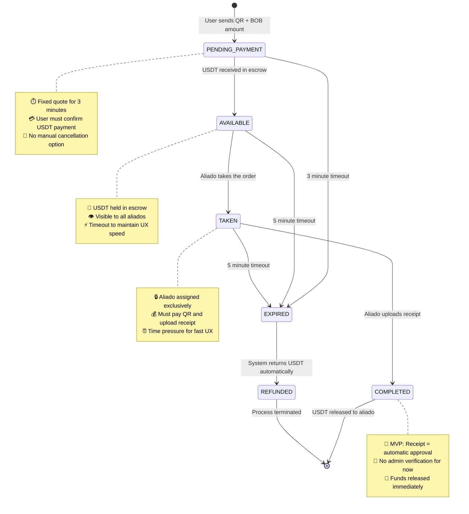
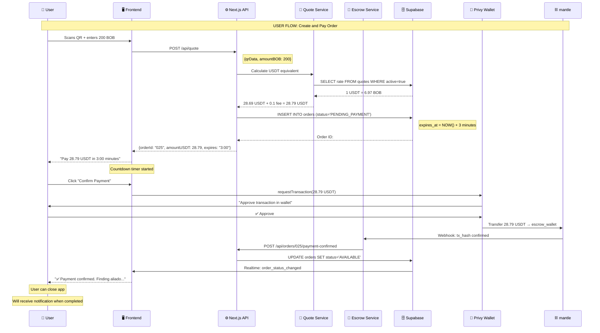
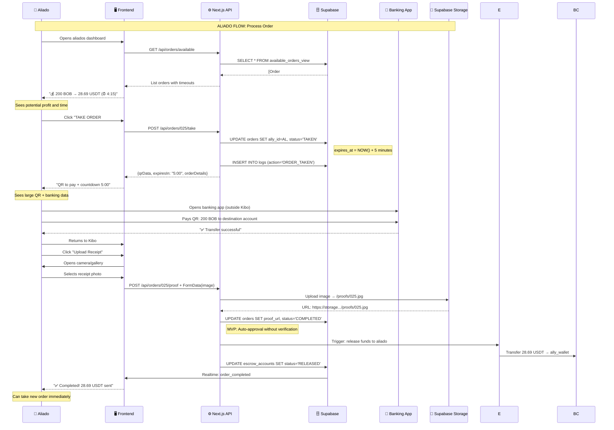
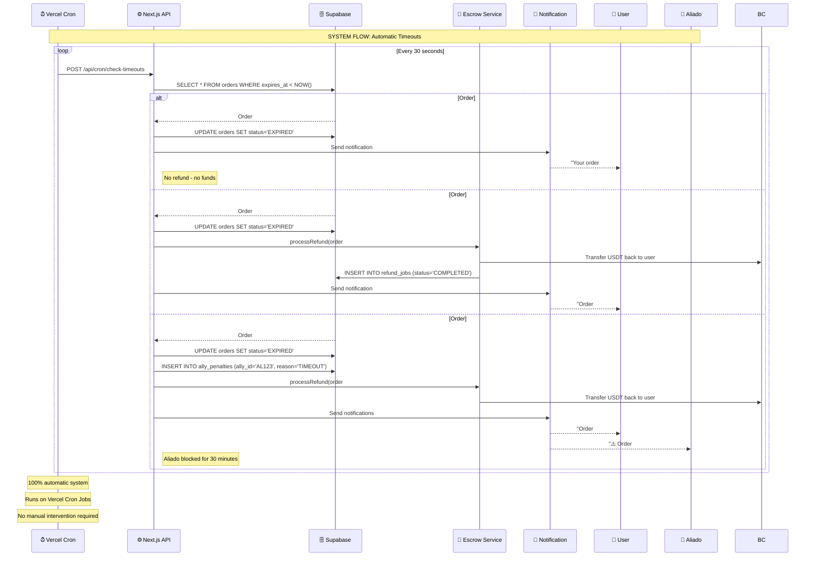
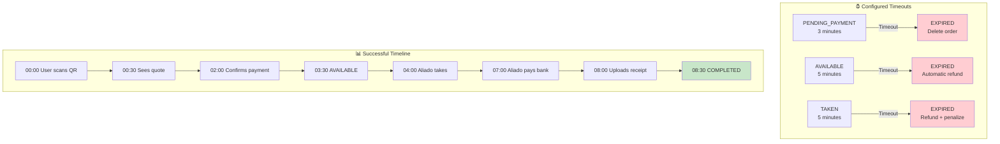
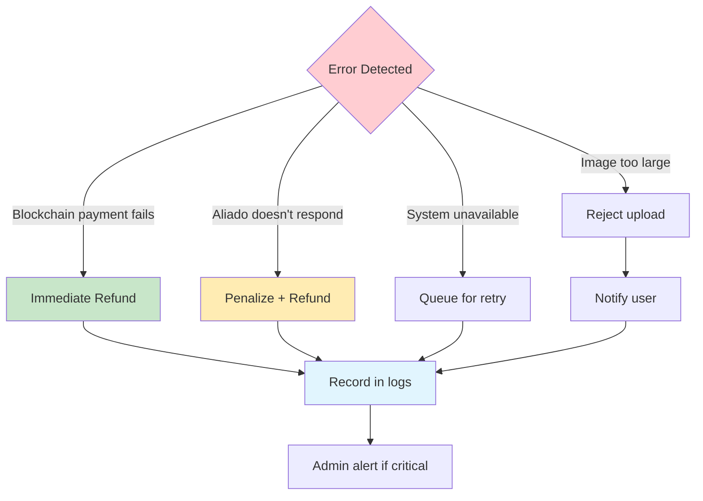
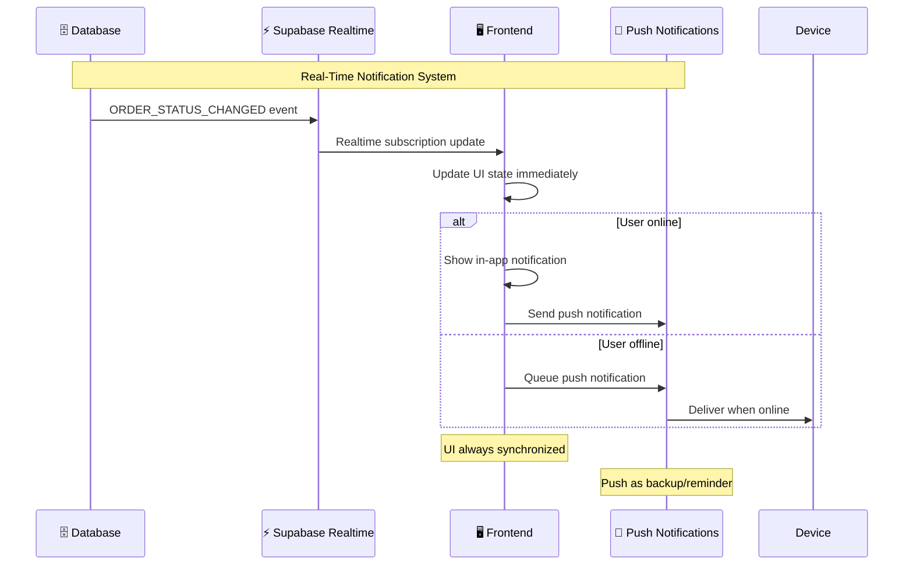

# 🔄 Kibo - States and Process Flows

## Order States (State Machine)



## Detailed State Descriptions

### 🟡 **PENDING_PAYMENT** 
```
🎯 What it means: Order created, waiting for user's USDT payment
⏱️ Duration: 3 minutes
🔄 Can go to: AVAILABLE, EXPIRED
✨ Trigger: User sends QR + BOB amount

Characteristics:
• USDT/BOB quote fixed for 3 minutes
• User sees real-time countdown
• Cannot be cancelled manually
• If not paid → order deleted (EXPIRED)
```

### 🔵 **AVAILABLE**
```
🎯 What it means: USDT received, order available for aliados
⏱️ Duration: 5 minutes
🔄 Can go to: TAKEN, EXPIRED  
✨ Trigger: USDT payment confirmation on blockchain

Characteristics:
• Funds locked in escrow
• Visible on aliados dashboard
• Only aliados from same country can see it
• Auto-refresh every 10 seconds
• If no one takes it → automatic refund
```

### 🟣 **TAKEN**
```
🎯 What it means: Aliado assigned, must process payment
⏱️ Duration: 5 minutes
🔄 Can go to: COMPLETED, EXPIRED
✨ Trigger: Aliado accepts available order

Characteristics:
• Order locked exclusively for one aliado
• QR shown only to assigned aliado
• Must pay in banking app and upload receipt
• Visible countdown for time pressure
• If not completed → penalty + refund
```

### 🟢 **COMPLETED**
```
🎯 What it means: Successful process, USDT released to aliado
⏱️ Duration: Final state
🔄 Can go to: [Final]
✨ Trigger: Aliado uploads receipt (auto-approved in MVP)

Characteristics:
• Receipt uploaded = automatic approval
• USDT transferred immediately to aliado
• Notifications sent to user and aliado
• Aliado statistics updated
• Complete logs recorded
```

### 🔴 **EXPIRED**
```
🎯 What it means: Timeout at any stage of the process
⏱️ Duration: Immediate → REFUNDED
🔄 Can go to: REFUNDED
✨ Trigger: Any configured timeout

Characteristics:
• Can occur in PENDING_PAYMENT, AVAILABLE, or TAKEN
• If funds in escrow → triggers automatic refund
• Aliado receives penalty if was in TAKEN
• User notified of the issue
```

### ⚪ **REFUNDED**
```
🎯 What it means: USDT returned to original user
⏱️ Duration: Final state
🔄 Can go to: [Final]
✨ Trigger: Any expiration with funds in escrow

Characteristics:
• USDT automatically returned to original wallet
• Transaction hash recorded
• User notified of refund
• Order marked as closed
• Does not impact user reputation
```

## User Flow (Create and Pay Order)



## Aliado Flow (Take and Process Order)



## System Flow (Automatic Timeout Management)



## Timeouts and Business Rules

### ⏰ **Timeouts by State**



### 🔒 **Locking Rules**

| Rule | Description | Implementation |
|------|-------------|----------------|
| **One aliado, one order** | Aliado can only have 1 TAKEN order at a time | `WHERE ally_id IS NULL AND user NOT IN (SELECT ally_id FROM orders WHERE status='TAKEN')` |
| **Timeout penalty** | Aliado who lets order expire gets blocked 30 min | `INSERT INTO ally_penalties (penalty_until = NOW() + INTERVAL '30 minutes')` |
| **No retaking expired order** | Same aliado cannot retake order they let expire | `WHERE order_id NOT IN (SELECT order_id FROM ally_penalties WHERE ally_id = ?)` |
| **Country specific** | Aliados only see orders from their country | `WHERE user.country = ally.country` |
| **Unique quote** | One quote per order, fixed until completion | `UPDATE quotes SET is_active=false WHERE order_id = ?` |

### 🚨 **Automatic Error Handling**



### 📊 **Performance Metrics**

| Metric | MVP Target | Measurement |
|--------|------------|-------------|
| **Average order time** | < 10 minutes | `AVG(completed_at - created_at)` |
| **Success rate** | > 80% | `COMPLETED / TOTAL * 100` |
| **Timeout rate** | < 15% | `EXPIRED / TOTAL * 100` |
| **Daily active aliados** | > 5 aliados | `COUNT(DISTINCT ally_id) WHERE DATE(taken_at) = TODAY` |
| **Daily volume** | > 1000 BOB | `SUM(amount_fiat) WHERE DATE(created_at) = TODAY` |

## Real-Time Notifications

### 🔔 **Notification Events**

```mermaid
graph TB
    subgraph "👤 User Receives"
        U1[🔔 Aliado assigned to your order]
        U2[🔔 Payment completed successfully]
        U3[🔔 Order expired - USDT returned]
        U4[🔔 Error in process]
    end
    
    subgraph "🤝 Aliado Receives"
        A1[🔔 New order available in your area]
        A2[🔔 Order taken successfully]
        A3[🔔 Receipt processed - USDT received]
        A4[🔔 Order expired - penalty applied]
    end
    
    subgraph "👨‍💼 Admin Receives"
        AD1[🔔 High volume of timeouts]
        AD2[🔔 External API not responding]
        AD3[🔔 Escrow wallet low balance]
        AD4[🔔 Aliado with suspicious behavior]
    end

    subgraph "🎯 System Triggers"
        ORDER_TAKEN[Order taken]
        ORDER_COMPLETED[Order completed]
        ORDER_EXPIRED[Order expired]
        SYSTEM_MONITOR[System monitor]
    end

    %% Connections from triggers to notifications
    ORDER_TAKEN --> U1
    ORDER_COMPLETED --> U2
    ORDER_COMPLETED --> A3
    ORDER_EXPIRED --> U3
    ORDER_EXPIRED --> A4
    
    SYSTEM_MONITOR --> AD1
    SYSTEM_MONITOR --> AD2
    SYSTEM_MONITOR --> AD3
    SYSTEM_MONITOR --> AD4
    
    classDef user fill:#e3f2fd
    classDef ally fill:#e8f5e8
    classDef admin fill:#ffebee
    classDef trigger fill:#fff3e0
    
    class U1,U2,U3,U4 user
    class A1,A2,A3,A4 ally
    class AD1,AD2,AD3,AD4 admin
    class ORDER_TAKEN,ORDER_COMPLETED,ORDER_EXPIRED,SYSTEM_MONITOR trigger
```



### 📱 **Notification Implementation**



---

**🎯 Importance for the Team:**

- **Frontend**: Knows exactly which states to show and when
- **Backend**: Clear automatic transition logic
- **QA**: Defined test cases for each transition
- **Product**: Optimized timeouts for better UX
- **DevOps**: Self-managed system requiring minimal intervention

**🔑 Key Decisions:**
- **Aggressive timeouts**: 3-5-5 minutes for fast UX
- **MVP auto-approval**: No manual verification to simplify
- **Automatic penalties**: Maintain quality without intervention
- **Immediate refunds**: Users never lose money due to timeouts
