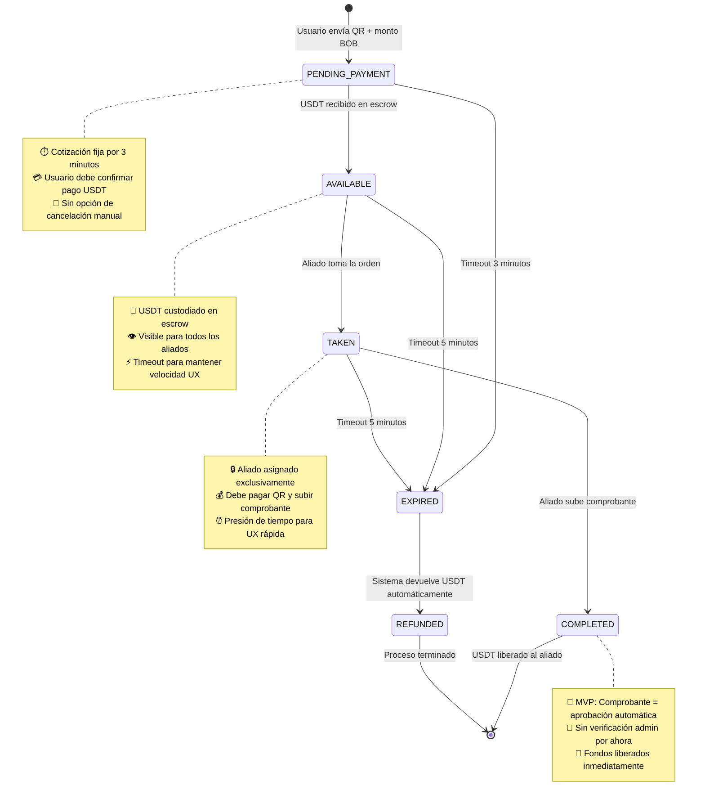
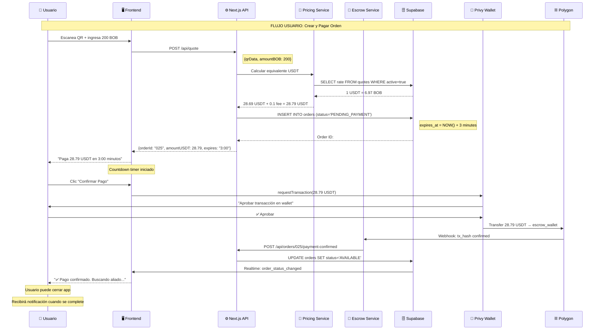
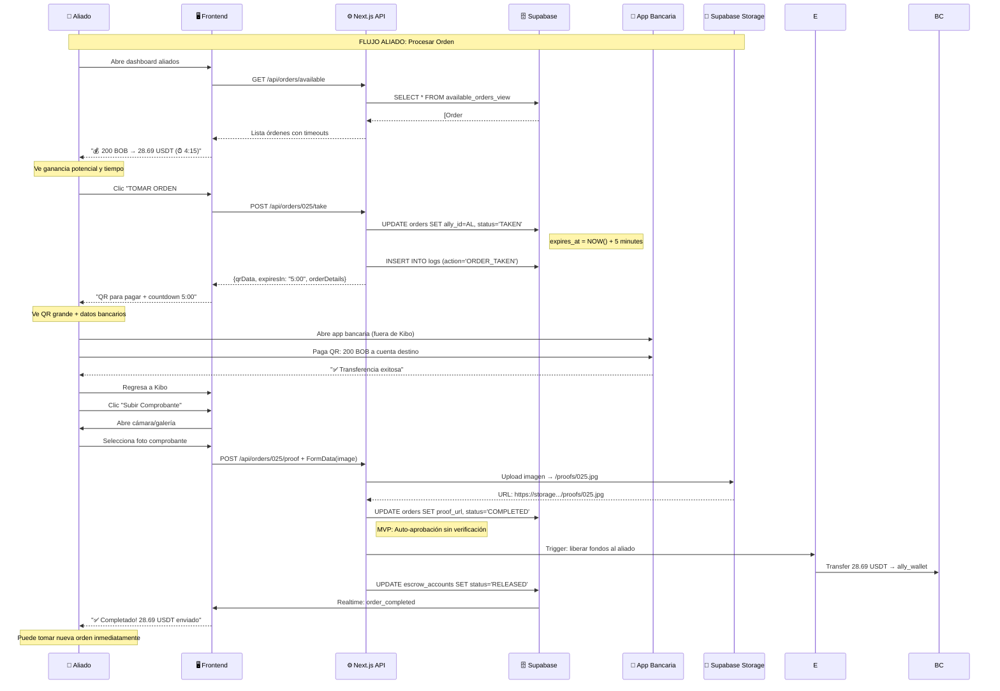
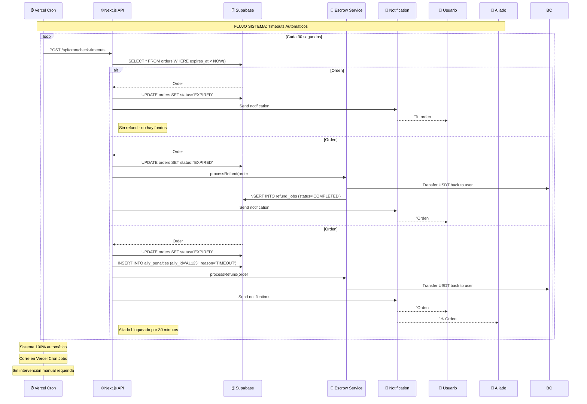
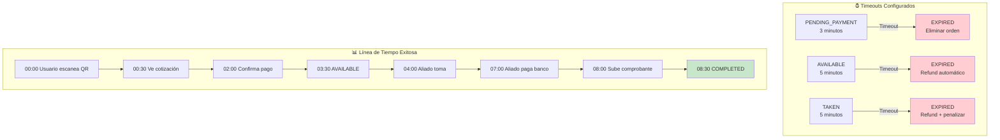
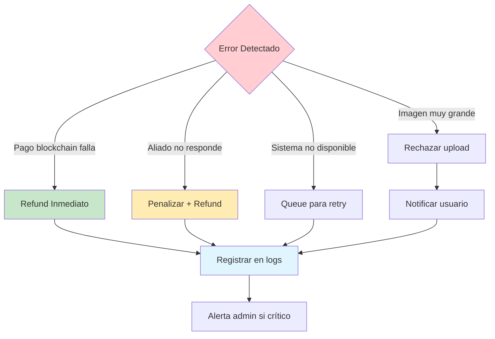
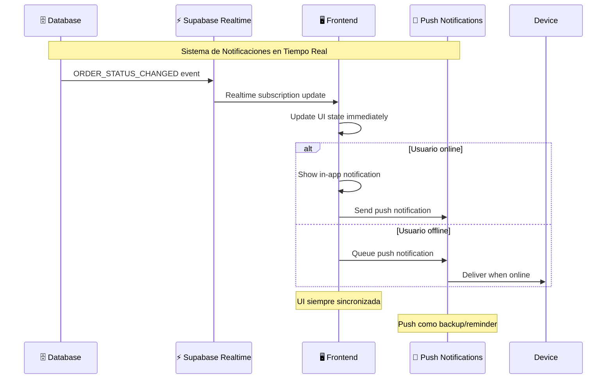

# 🔄 Kibo - Estados y Flujos de Proceso

## Estados de la Orden (State Machine)



## Descripción Detallada de Estados

### 🟡 **PENDING_PAYMENT** 
```
🎯 Qué significa: Orden creada, esperando pago USDT del usuario
⏱️ Duración: 3 minutos
🔄 Puede ir a: AVAILABLE, EXPIRED
✨ Trigger: Usuario envía QR + monto BOB

Características:
• Cotización USDT/BOB fija durante 3 minutos
• Usuario ve countdown en tiempo real
• No se puede cancelar manualmente
• Si no paga → orden se elimina (EXPIRED)
```

### 🔵 **AVAILABLE**
```
🎯 Qué significa: USDT recibido, orden disponible para aliados
⏱️ Duración: 5 minutos
🔄 Puede ir a: TAKEN, EXPIRED  
✨ Trigger: Confirmación de pago USDT en blockchain

Características:
• Fondos bloqueados en escrow
• Visible en dashboard de aliados
• Solo aliados del mismo país pueden verla
• Auto-refresh cada 10 segundos
• Si nadie toma → refund automático
```

### 🟣 **TAKEN**
```
🎯 Qué significa: Aliado asignado, debe procesar pago
⏱️ Duración: 5 minutos
🔄 Puede ir a: COMPLETED, EXPIRED
✨ Trigger: Aliado acepta orden disponible

Características:
• Orden bloqueada exclusivamente para un aliado
• QR mostrado solo al aliado asignado
• Debe pagar en app bancaria y subir comprobante
• Countdown visible para presión de tiempo
• Si no completa → penalización + refund
```

### 🟢 **COMPLETED**
```
🎯 Qué significa: Proceso exitoso, USDT liberado al aliado
⏱️ Duración: Estado final
🔄 Puede ir a: [Final]
✨ Trigger: Aliado sube comprobante (auto-aprobado en MVP)

Características:
• Comprobante subido = aprobación automática
• USDT transferido inmediatamente al aliado
• Notificaciones enviadas a usuario y aliado
• Estadísticas del aliado actualizadas
• Logs completos registrados
```

### 🔴 **EXPIRED**
```
🎯 Qué significa: Timeout en cualquier etapa del proceso
⏱️ Duración: Inmediato → REFUNDED
🔄 Puede ir a: REFUNDED
✨ Trigger: Cualquier timeout configurado

Características:
• Puede ocurrir en PENDING_PAYMENT, AVAILABLE, o TAKEN
• Si hay fondos en escrow → activa refund automático
• Aliado recibe penalización si estaba en TAKEN
• Usuario notificado del problema
```

### ⚪ **REFUNDED**
```
🎯 Qué significa: USDT devuelto al usuario original
⏱️ Duración: Estado final
🔄 Puede ir a: [Final]
✨ Trigger: Cualquier expiración con fondos en escrow

Características:
• USDT devuelto automáticamente al wallet original
• Hash de transacción registrado
• Usuario notificado del reembolso
• Orden marcada como cerrada
• No impacta reputación del usuario
```

## Flujo de Usuario (Crear y Pagar Orden)



## Flujo de Aliado (Tomar y Procesar Orden)



## Flujo de Sistema (Manejo de Timeouts Automático)



## Timeouts y Reglas de Negocio

### ⏰ **Timeouts por Estado**



### 🔒 **Reglas de Bloqueo**

| Regla | Descripción | Implementación |
|-------|-------------|----------------|
| **Un aliado, una orden** | Aliado solo puede tener 1 orden TAKEN a la vez | `WHERE ally_id IS NULL AND user NOT IN (SELECT ally_id FROM orders WHERE status='TAKEN')` |
| **Penalización por timeout** | Aliado que deja expirar se bloquea 30 min | `INSERT INTO ally_penalties (penalty_until = NOW() + INTERVAL '30 minutes')` |
| **No re-tomar orden expirada** | Mismo aliado no puede retomar orden que dejó expirar | `WHERE order_id NOT IN (SELECT order_id FROM ally_penalties WHERE ally_id = ?)` |
| **País específico** | Aliados solo ven órdenes de su país | `WHERE user.country = ally.country` |
| **Cotización única** | Una cotización por orden, fija hasta completar | `UPDATE quotes SET is_active=false WHERE order_id = ?` |

### 🚨 **Manejo de Errores Automático**



### 📊 **Métricas de Performance**

| Métrica | Target MVP | Medición |
|---------|------------|----------|
| **Tiempo promedio de orden** | < 10 minutos | `AVG(completed_at - created_at)` |
| **Tasa de éxito** | > 80% | `COMPLETED / TOTAL * 100` |
| **Tasa de timeout** | < 15% | `EXPIRED / TOTAL * 100` |
| **Aliados activos diarios** | > 5 aliados | `COUNT(DISTINCT ally_id) WHERE DATE(taken_at) = TODAY` |
| **Volumen diario** | > 1000 BOB | `SUM(amount_fiat) WHERE DATE(created_at) = TODAY` |

## Notificaciones en Tiempo Real

### 🔔 **Eventos de Notificación**

```mermaid
graph TB
    subgraph "👤 Usuario Recibe"
        U1[🔔 Aliado asignado a tu orden]
        U2[🔔 Pago completado exitosamente]
        U3[🔔 Orden expiró - USDT devuelto]
        U4[🔔 Error en el proceso]
    end
    
    subgraph "🤝 Aliado Recibe"
        A1[🔔 Nueva orden disponible en tu área]
        A2[🔔 Orden tomada exitosamente]
        A3[🔔 Comprobante procesado - USDT recibido]
        A4[🔔 Orden expiró - penalización aplicada]
    end
    
    subgraph "👨‍💼 Admin Recibe"
        AD1[🔔 Volumen alto de timeouts]
        AD2[🔔 API externa no responde]
        AD3[🔔 Escrow wallet saldo bajo]
        AD4[🔔 Aliado con comportamiento sospechoso]
    end

    subgraph "🎯 Triggers del Sistema"
        ORDER_TAKEN[Orden tomada]
        ORDER_COMPLETED[Orden completada]
        ORDER_EXPIRED[Orden expirada]
        SYSTEM_MONITOR[Monitor del sistema]
    end

    %% Conexiones de triggers a notificaciones
    ORDER_TAKEN --> U1
    ORDER_COMPLETED --> U2
    ORDER_COMPLETED --> A3
    ORDER_EXPIRED --> U3
    ORDER_EXPIRED --> A4
    
    SYSTEM_MONITOR --> AD1
    SYSTEM_MONITOR --> AD2
    SYSTEM_MONITOR --> AD3
    SYSTEM_MONITOR --> AD4
    
    classDef user fill:#e3f2fd
    classDef ally fill:#e8f5e8
    classDef admin fill:#ffebee
    classDef trigger fill:#fff3e0
    
    class U1,U2,U3,U4 user
    class A1,A2,A3,A4 ally
    class AD1,AD2,AD3,AD4 admin
    class ORDER_TAKEN,ORDER_COMPLETED,ORDER_EXPIRED,SYSTEM_MONITOR trigger
```



### 📱 **Implementación de Notificaciones**



---

**🎯 Importancia para el Equipo:**

- **Frontend**: Sabe exactamente qué estados mostrar y cuándo
- **Backend**: Lógica de transiciones automáticas clara
- **QA**: Casos de prueba definidos para cada transición
- **Product**: Timeouts optimizados para mejor UX
- **DevOps**: Sistema auto-gestionado que requiere mínima intervención

**🔑 Decisiones Clave:**
- **Timeouts agresivos**: 3-5-5 minutos para UX rápida
- **Auto-aprobación MVP**: Sin verificación manual para simplificar
- **Penalizaciones automáticas**: Mantienen calidad sin intervención
- **Refunds inmediatos**: Usuarios nunca pierden dinero por timeouts
