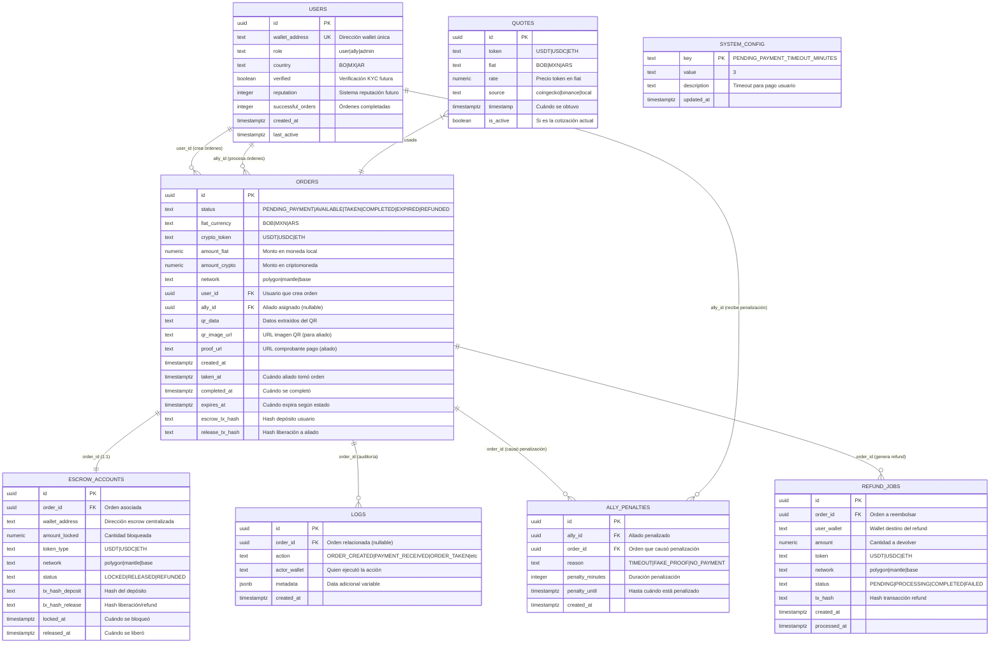
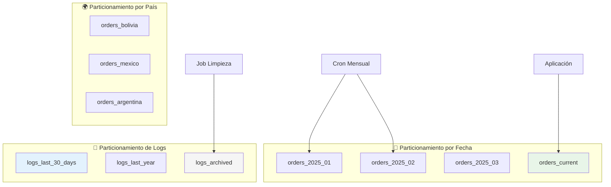
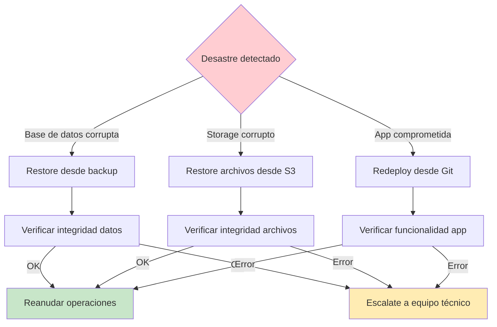

# 🗄️ Kibo - Modelo de Datos

## Diagrama de Entidad-Relación



## Definición de Tablas Principales

### 👤 **USERS - Gestión de Usuarios**

| Campo | Tipo | Descripción | Constraints |
|-------|------|-------------|-------------|
| `id` | UUID | ID único del usuario | PRIMARY KEY, DEFAULT gen_random_uuid() |
| `wallet_address` | TEXT | Dirección wallet (0x...) | UNIQUE, NOT NULL |
| `role` | TEXT | Tipo de usuario | CHECK (role IN ('user', 'ally', 'admin')), DEFAULT 'user' |
| `country` | TEXT | País del usuario | NOT NULL, DEFAULT 'BO' |
| `verified` | BOOLEAN | Verificación KYC (futuro) | DEFAULT false |
| `reputation` | INTEGER | Score de reputación | DEFAULT 0 |
| `successful_orders` | INTEGER | Órdenes completadas exitosamente | DEFAULT 0 |
| `created_at` | TIMESTAMPTZ | Fecha de registro | DEFAULT NOW() |
| `last_active` | TIMESTAMPTZ | Última actividad | DEFAULT NOW() |

**Índices:**
```sql
CREATE INDEX idx_users_wallet ON users(wallet_address);
CREATE INDEX idx_users_role_country ON users(role, country);
CREATE INDEX idx_users_active_allies ON users(role, last_active) WHERE role = 'ally';
```

### 📋 **ORDERS - Tabla Central del Sistema**

| Campo | Tipo | Descripción | Constraints |
|-------|------|-------------|-------------|
| `id` | UUID | ID único de la orden | PRIMARY KEY, DEFAULT gen_random_uuid() |
| `status` | TEXT | Estado actual de la orden | CHECK (status IN ('PENDING_PAYMENT', 'AVAILABLE', 'TAKEN', 'COMPLETED', 'EXPIRED', 'REFUNDED')) |
| `fiat_currency` | TEXT | Moneda fiat (BOB, MXN, ARS) | NOT NULL, DEFAULT 'BOB' |
| `crypto_token` | TEXT | Token crypto (USDT, USDC, ETH) | NOT NULL, DEFAULT 'USDT' |
| `amount_fiat` | NUMERIC(10,2) | Cantidad en moneda fiat | NOT NULL, CHECK (amount_fiat > 0) |
| `amount_crypto` | NUMERIC(18,8) | Cantidad en criptomoneda | NOT NULL, CHECK (amount_crypto > 0) |
| `network` | TEXT | Red blockchain | NOT NULL, DEFAULT 'polygon' |
| `user_id` | UUID | Usuario que crea la orden | NOT NULL, REFERENCES users(id) |
| `ally_id` | UUID | Aliado asignado | REFERENCES users(id) |
| `qr_data` | TEXT | Datos extraídos del QR | NOT NULL |
| `qr_image_url` | TEXT | URL imagen QR (Supabase Storage) | |
| `proof_url` | TEXT | URL comprobante (Supabase Storage) | |
| `created_at` | TIMESTAMPTZ | Cuándo se creó | DEFAULT NOW() |
| `taken_at` | TIMESTAMPTZ | Cuándo aliado la tomó | |
| `completed_at` | TIMESTAMPTZ | Cuándo se completó | |
| `expires_at` | TIMESTAMPTZ | Cuándo expira (dinámico por estado) | NOT NULL |
| `escrow_tx_hash` | TEXT | Hash depósito del usuario | |
| `release_tx_hash` | TEXT | Hash liberación al aliado | |

**Índices Críticos:**
```sql
CREATE INDEX idx_orders_status ON orders(status);
CREATE INDEX idx_orders_available ON orders(status, expires_at) WHERE status = 'AVAILABLE';
CREATE INDEX idx_orders_user ON orders(user_id, created_at DESC);
CREATE INDEX idx_orders_ally ON orders(ally_id, taken_at DESC);
CREATE INDEX idx_orders_expires ON orders(expires_at) WHERE status IN ('PENDING_PAYMENT', 'AVAILABLE', 'TAKEN');
CREATE INDEX idx_orders_country ON orders(user_id) INCLUDE (status);
```

### 💱 **QUOTES - Cotizaciones de Mercado**

| Campo | Tipo | Descripción | Constraints |
|-------|------|-------------|-------------|
| `id` | UUID | ID único de la cotización | PRIMARY KEY, DEFAULT gen_random_uuid() |
| `token` | TEXT | Token cotizado | NOT NULL |
| `fiat` | TEXT | Moneda fiat de referencia | NOT NULL |
| `rate` | NUMERIC(18,8) | Precio del token en fiat | NOT NULL, CHECK (rate > 0) |
| `source` | TEXT | Fuente de la cotización | NOT NULL, DEFAULT 'coingecko' |
| `timestamp` | TIMESTAMPTZ | Cuándo se obtuvo | DEFAULT NOW() |
| `is_active` | BOOLEAN | Si es la cotización actual | DEFAULT true |

**Índices:**
```sql
CREATE INDEX idx_quotes_current ON quotes(token, fiat, timestamp DESC) WHERE is_active = true;
CREATE INDEX idx_quotes_history ON quotes(token, fiat, timestamp DESC);
```

### 🏦 **ESCROW_ACCOUNTS - Custodia de Fondos**

| Campo | Tipo | Descripción | Constraints |
|-------|------|-------------|-------------|
| `id` | UUID | ID único de la cuenta escrow | PRIMARY KEY, DEFAULT gen_random_uuid() |
| `order_id` | UUID | Orden asociada | NOT NULL, REFERENCES orders(id) ON DELETE CASCADE |
| `wallet_address` | TEXT | Dirección wallet escrow | NOT NULL |
| `amount_locked` | NUMERIC(18,8) | Cantidad bloqueada | NOT NULL, CHECK (amount_locked > 0) |
| `token_type` | TEXT | Tipo de token | NOT NULL, DEFAULT 'USDT' |
| `network` | TEXT | Red blockchain | NOT NULL, DEFAULT 'polygon' |
| `status` | TEXT | Estado del escrow | CHECK (status IN ('LOCKED', 'RELEASED', 'REFUNDED')), DEFAULT 'LOCKED' |
| `tx_hash_deposit` | TEXT | Hash del depósito | |
| `tx_hash_release` | TEXT | Hash de liberación/refund | |
| `locked_at` | TIMESTAMPTZ | Cuándo se bloqueó | DEFAULT NOW() |
| `released_at` | TIMESTAMPTZ | Cuándo se liberó | |

**Índices:**
```sql
CREATE UNIQUE INDEX idx_escrow_order ON escrow_accounts(order_id);
CREATE INDEX idx_escrow_status ON escrow_accounts(status, locked_at);
CREATE INDEX idx_escrow_wallet ON escrow_accounts(wallet_address, status);
```

### 📝 **LOGS - Auditoría Completa**

| Campo | Tipo | Descripción | Constraints |
|-------|------|-------------|-------------|
| `id` | UUID | ID único del log | PRIMARY KEY, DEFAULT gen_random_uuid() |
| `order_id` | UUID | Orden relacionada | REFERENCES orders(id) |
| `action` | TEXT | Acción ejecutada | NOT NULL |
| `actor_wallet` | TEXT | Quien ejecutó la acción | NOT NULL |
| `metadata` | JSONB | Información adicional | |
| `created_at` | TIMESTAMPTZ | Cuándo ocurrió | DEFAULT NOW() |

**Acciones Típicas:**
- `ORDER_CREATED`, `PAYMENT_RECEIVED`, `ORDER_TAKEN`, `PROOF_UPLOADED`, `ORDER_COMPLETED`, `ORDER_EXPIRED`, `REFUND_PROCESSED`, `ALLY_PENALIZED`

**Índices:**
```sql
CREATE INDEX idx_logs_order ON logs(order_id, created_at DESC);
CREATE INDEX idx_logs_action ON logs(action, created_at DESC);
CREATE INDEX idx_logs_actor ON logs(actor_wallet, created_at DESC);
CREATE INDEX idx_logs_time ON logs(created_at DESC);
```

### ⚠️ **ALLY_PENALTIES - Sistema de Penalizaciones**

| Campo | Tipo | Descripción | Constraints |
|-------|------|-------------|-------------|
| `id` | UUID | ID único de la penalización | PRIMARY KEY, DEFAULT gen_random_uuid() |
| `ally_id` | UUID | Aliado penalizado | NOT NULL, REFERENCES users(id) |
| `order_id` | UUID | Orden que causó la penalización | REFERENCES orders(id) |
| `reason` | TEXT | Razón de la penalización | CHECK (reason IN ('TIMEOUT', 'FAKE_PROOF', 'NO_PAYMENT')) |
| `penalty_minutes` | INTEGER | Duración en minutos | NOT NULL, DEFAULT 30 |
| `penalty_until` | TIMESTAMPTZ | Hasta cuándo está penalizado | NOT NULL |
| `created_at` | TIMESTAMPTZ | Cuándo se aplicó | DEFAULT NOW() |

**Índices:**
```sql
CREATE INDEX idx_penalties_ally ON ally_penalties(ally_id, penalty_until);
CREATE INDEX idx_penalties_active ON ally_penalties(penalty_until) WHERE penalty_until > NOW();
CREATE INDEX idx_penalties_reason ON ally_penalties(reason, created_at DESC);
```

### ⚙️ **SYSTEM_CONFIG - Configuración Dinámica**

| Campo | Tipo | Descripción | Ejemplo |
|-------|------|-------------|---------|
| `key` | TEXT | Clave de configuración | `PENDING_PAYMENT_TIMEOUT_MINUTES` |
| `value` | TEXT | Valor de la configuración | `3` |
| `description` | TEXT | Descripción para admins | `Timeout para pago de usuario` |
| `updated_at` | TIMESTAMPTZ | Última modificación | DEFAULT NOW() |

**Configuraciones Iniciales:**
```sql
INSERT INTO system_config (key, value, description) VALUES
('PENDING_PAYMENT_TIMEOUT_MINUTES', '3', 'Timeout para pago de usuario'),
('AVAILABLE_TIMEOUT_MINUTES', '5', 'Timeout para que aliado tome orden'),
('TAKEN_TIMEOUT_MINUTES', '5', 'Timeout para que aliado suba comprobante'),
('ALLY_PENALTY_MINUTES', '30', 'Minutos de penalización por timeout'),
('QUOTE_UPDATE_INTERVAL_SECONDS', '30', 'Intervalo de actualización de cotizaciones'),
('MIN_ORDER_AMOUNT_BOB', '10', 'Monto mínimo de orden en bolivianos'),
('MAX_ORDER_AMOUNT_BOB', '10000', 'Monto máximo de orden en bolivianos'),
('ESCROW_WALLET_ADDRESS', '0x...', 'Dirección del wallet escrow centralizado');
```

### 🔄 **REFUND_JOBS - Reembolsos Automáticos**

| Campo | Tipo | Descripción | Constraints |
|-------|------|-------------|-------------|
| `id` | UUID | ID único del refund | PRIMARY KEY, DEFAULT gen_random_uuid() |
| `order_id` | UUID | Orden a reembolsar | NOT NULL, REFERENCES orders(id) |
| `user_wallet` | TEXT | Wallet destino del refund | NOT NULL |
| `amount` | NUMERIC(18,8) | Cantidad a devolver | NOT NULL, CHECK (amount > 0) |
| `token` | TEXT | Token a devolver | NOT NULL, DEFAULT 'USDT' |
| `network` | TEXT | Red blockchain | NOT NULL, DEFAULT 'polygon' |
| `status` | TEXT | Estado del refund | CHECK (status IN ('PENDING', 'PROCESSING', 'COMPLETED', 'FAILED')), DEFAULT 'PENDING' |
| `tx_hash` | TEXT | Hash de la transacción refund | |
| `created_at` | TIMESTAMPTZ | Cuándo se creó el job | DEFAULT NOW() |
| `processed_at` | TIMESTAMPTZ | Cuándo se procesó | |

**Índices:**
```sql
CREATE INDEX idx_refund_status ON refund_jobs(status, created_at);
CREATE INDEX idx_refund_pending ON refund_jobs(created_at) WHERE status = 'PENDING';
CREATE UNIQUE INDEX idx_refund_order ON refund_jobs(order_id);
```

## Views Optimizadas para Frontend

### 📋 **available_orders_view - Órdenes para Aliados**

```sql
CREATE VIEW available_orders_view AS
SELECT 
    o.id,
    o.amount_fiat,
    o.amount_crypto,
    o.fiat_currency,
    o.crypto_token,
    o.qr_image_url,
    o.expires_at,
    EXTRACT(EPOCH FROM (o.expires_at - NOW())) AS seconds_remaining,
    u.wallet_address as user_wallet,
    u.country as user_country,
    o.created_at
FROM orders o
JOIN users u ON o.user_id = u.id
WHERE o.status = 'AVAILABLE' 
  AND o.expires_at > NOW()
ORDER BY o.created_at ASC;
```

### 👤 **user_order_summary - Dashboard Usuario**

```sql
CREATE VIEW user_order_summary AS
SELECT 
    o.id,
    o.status,
    o.amount_fiat,
    o.amount_crypto,
    o.fiat_currency,
    o.crypto_token,
    o.created_at,
    o.completed_at,
    ally.wallet_address as ally_wallet,
    CASE 
        WHEN o.status IN ('PENDING_PAYMENT', 'AVAILABLE', 'TAKEN') 
        THEN EXTRACT(EPOCH FROM (o.expires_at - NOW()))
        ELSE NULL 
    END as seconds_remaining,
    CASE o.status
        WHEN 'PENDING_PAYMENT' THEN '⏳ Esperando tu pago'
        WHEN 'AVAILABLE' THEN '🔍 Buscando aliado'
        WHEN 'TAKEN' THEN '🤝 Aliado procesando'
        WHEN 'COMPLETED' THEN '✅ Completado'
        WHEN 'EXPIRED' THEN '❌ Expirado'
        WHEN 'REFUNDED' THEN '💰 Reembolsado'
    END as status_text
FROM orders o
LEFT JOIN users ally ON o.ally_id = ally.id
ORDER BY o.created_at DESC;
```

### 🤝 **ally_dashboard_view - Dashboard Aliado**

```sql
CREATE VIEW ally_dashboard_view AS
SELECT 
    a.id as ally_id,
    a.wallet_address,
    COUNT(o.id) as total_orders,
    COUNT(CASE WHEN o.status = 'COMPLETED' THEN 1 END) as completed_orders,
    COUNT(CASE WHEN o.status = 'EXPIRED' AND o.ally_id = a.id THEN 1 END) as expired_orders,
    COALESCE(AVG(EXTRACT(EPOCH FROM (o.completed_at - o.taken_at))/60), 0) as avg_completion_minutes,
    COALESCE(SUM(CASE WHEN o.status = 'COMPLETED' THEN o.amount_crypto ELSE 0 END), 0) as total_earned_usdt,
    -- Órdenes hoy
    COUNT(CASE WHEN DATE(o.taken_at) = CURRENT_DATE AND o.status = 'COMPLETED' THEN 1 END) as orders_today,
    COALESCE(SUM(CASE WHEN DATE(o.taken_at) = CURRENT_DATE AND o.status = 'COMPLETED' THEN o.amount_crypto ELSE 0 END), 0) as earned_today,
    -- Estado actual
    (SELECT COUNT(*) FROM ally_penalties WHERE ally_id = a.id AND penalty_until > NOW()) as is_penalized,
    (SELECT o2.id FROM orders o2 WHERE o2.ally_id = a.id AND o2.status = 'TAKEN' LIMIT 1) as active_order_id
FROM users a
LEFT JOIN orders o ON a.id = o.ally_id
WHERE a.role = 'ally'
GROUP BY a.id, a.wallet_address;
```

### 👨‍💼 **admin_metrics_view - Métricas Administrativas**

```sql
CREATE VIEW admin_metrics_view AS
SELECT 
    -- Métricas del día
    COUNT(CASE WHEN DATE(created_at) = CURRENT_DATE THEN 1 END) as orders_today,
    COUNT(CASE WHEN DATE(created_at) = CURRENT_DATE AND status = 'COMPLETED' THEN 1 END) as completed_today,
    COUNT(CASE WHEN DATE(created_at) = CURRENT_DATE AND status = 'EXPIRED' THEN 1 END) as expired_today,
    COALESCE(SUM(CASE WHEN DATE(created_at) = CURRENT_DATE THEN amount_fiat ELSE 0 END), 0) as volume_fiat_today,
    COALESCE(SUM(CASE WHEN DATE(created_at) = CURRENT_DATE THEN amount_crypto ELSE 0 END), 0) as volume_crypto_today,
    
    -- Métricas generales
    COUNT(*) as total_orders,
    COUNT(CASE WHEN status = 'COMPLETED' THEN 1 END) as total_completed,
    ROUND(COUNT(CASE WHEN status = 'COMPLETED' THEN 1 END) * 100.0 / COUNT(*), 2) as success_rate,
    
    -- Aliados activos
    (SELECT COUNT(DISTINCT ally_id) FROM orders WHERE DATE(taken_at) = CURRENT_DATE) as active_allies_today,
    (SELECT COUNT(*) FROM users WHERE role = 'ally') as total_allies,
    
    -- Timeouts por estado
    COUNT(CASE WHEN status = 'EXPIRED' AND taken_at IS NULL THEN 1 END) as timeouts_available,
    COUNT(CASE WHEN status = 'EXPIRED' AND taken_at IS NOT NULL THEN 1 END) as timeouts_taken
    
FROM orders;
```

## Triggers y Funciones Automáticas

### 🔄 **Trigger: Auto-logging de Cambios**

```sql
CREATE OR REPLACE FUNCTION auto_log_order_changes()
RETURNS TRIGGER AS $
BEGIN
    IF TG_OP = 'INSERT' THEN
        INSERT INTO logs (order_id, action, actor_wallet, metadata)
        VALUES (NEW.id, 'ORDER_CREATED', NEW.user_id::text, 
                jsonb_build_object(
                    'amount_fiat', NEW.amount_fiat,
                    'amount_crypto', NEW.amount_crypto,
                    'fiat_currency', NEW.fiat_currency,
                    'crypto_token', NEW.crypto_token
                ));
        RETURN NEW;
    ELSIF TG_OP = 'UPDATE' THEN
        IF OLD.status != NEW.status THEN
            INSERT INTO logs (order_id, action, actor_wallet, metadata)
            VALUES (NEW.id, 'STATUS_CHANGED', 
                    COALESCE(NEW.ally_id::text, NEW.user_id::text),
                    jsonb_build_object(
                        'old_status', OLD.status, 
                        'new_status', NEW.status,
                        'timestamp', NOW()
                    ));
        END IF;
        RETURN NEW;
    END IF;
    RETURN NULL;
END;
$ LANGUAGE plpgsql;

CREATE TRIGGER trigger_auto_log_orders
    AFTER INSERT OR UPDATE ON orders
    FOR EACH ROW
    EXECUTE FUNCTION auto_log_order_changes();
```

### ⏰ **Función: Verificar Aliado Penalizado**

```sql
CREATE OR REPLACE FUNCTION is_ally_penalized(ally_id_param UUID)
RETURNS BOOLEAN AS $
DECLARE
    penalty_count INTEGER;
BEGIN
    SELECT COUNT(*) INTO penalty_count
    FROM ally_penalties
    WHERE ally_id = ally_id_param 
      AND penalty_until > NOW();
    
    RETURN penalty_count > 0;
END;
$ LANGUAGE plpgsql;
```

### 💱 **Función: Obtener Cotización Actual**

```sql
CREATE OR REPLACE FUNCTION get_current_rate(token_param TEXT, fiat_param TEXT)
RETURNS NUMERIC AS $
DECLARE
    current_rate NUMERIC;
BEGIN
    SELECT rate INTO current_rate 
    FROM quotes 
    WHERE token = token_param 
      AND fiat = fiat_param 
      AND is_active = true
    ORDER BY timestamp DESC 
    LIMIT 1;
    
    IF current_rate IS NULL THEN
        RAISE EXCEPTION 'No active rate found for % to %', token_param, fiat_param;
    END IF;
    
    RETURN current_rate;
END;
$ LANGUAGE plpgsql;
```

### 📊 **Función: Estadísticas de Aliado**

```sql
CREATE OR REPLACE FUNCTION get_ally_stats(ally_id_param UUID)
RETURNS TABLE (
    total_orders INT,
    completed_orders INT,
    success_rate NUMERIC,
    avg_completion_time INTERVAL,
    total_earned NUMERIC,
    penalties_count INT
) AS $
BEGIN
    RETURN QUERY
    SELECT 
        COUNT(o.id)::INT as total_orders,
        COUNT(CASE WHEN o.status = 'COMPLETED' THEN 1 END)::INT as completed_orders,
        ROUND(
            COUNT(CASE WHEN o.status = 'COMPLETED' THEN 1 END) * 100.0 / 
            NULLIF(COUNT(o.id), 0), 2
        ) as success_rate,
        AVG(o.completed_at - o.taken_at) as avg_completion_time,
        COALESCE(SUM(CASE WHEN o.status = 'COMPLETED' THEN o.amount_crypto ELSE 0 END), 0) as total_earned,
        (SELECT COUNT(*)::INT FROM ally_penalties WHERE ally_id = ally_id_param) as penalties_count
    FROM orders o
    WHERE o.ally_id = ally_id_param;
END;
$ LANGUAGE plpgsql;
```

### 🔧 **Función: Obtener Configuración**

```sql
CREATE OR REPLACE FUNCTION get_config(config_key TEXT)
RETURNS TEXT AS $
DECLARE
    config_value TEXT;
BEGIN
    SELECT value INTO config_value 
    FROM system_config 
    WHERE key = config_key;
    
    IF config_value IS NULL THEN
        RAISE EXCEPTION 'Configuration key % not found', config_key;
    END IF;
    
    RETURN config_value;
END;
$ LANGUAGE plpgsql;
```

## Estrategia de Particionamiento (Futuro)



## Backup y Recuperación

### 📦 **Estrategia de Backup**

| Componente | Frecuencia | Retención | Método |
|------------|------------|-----------|--------|
| **Órdenes activas** | Tiempo real | 1 año | Supabase Point-in-Time Recovery |
| **Logs críticos** | Diario | 90 días | Export a S3 |
| **Configuración** | Semanal | 6 meses | Git + Base de datos |
| **Imágenes (QR/Proofs)** | Diario | 1 año | Supabase Storage Backup |

### 🔄 **Plan de Recuperación**



## Índices de Performance Críticos

### ⚡ **Índices Más Importantes para Queries Frecuentes**

```sql
-- Para dashboard de aliados (query más frecuente)
CREATE INDEX idx_orders_available_urgent ON orders(status, expires_at, created_at) 
WHERE status = 'AVAILABLE';

-- Para tracking de usuarios
CREATE INDEX idx_orders_user_recent ON orders(user_id, created_at DESC, status);

-- Para timeouts automation
CREATE INDEX idx_orders_timeout_check ON orders(expires_at, status) 
WHERE status IN ('PENDING_PAYMENT', 'AVAILABLE', 'TAKEN');

-- Para admin dashboard
CREATE INDEX idx_orders_admin_today ON orders(created_at, status) 
WHERE created_at >= CURRENT_DATE;

-- Para ally penalties check
CREATE INDEX idx_penalties_active_check ON ally_penalties(ally_id, penalty_until) 
WHERE penalty_until > NOW();

-- Para logs performance
CREATE INDEX idx_logs_recent ON logs(created_at DESC, action);
CREATE INDEX idx_logs_order_timeline ON logs(order_id, created_at ASC);
```

### 📊 **Análisis de Performance Esperado**

| Query Tipo | Frecuencia | Tiempo Esperado | Índice Clave |
|------------|------------|-----------------|--------------|
| **Ver órdenes disponibles** | Cada 10s por aliado | < 50ms | `idx_orders_available_urgent` |
| **Dashboard usuario** | Cada carga página | < 100ms | `idx_orders_user_recent` |
| **Check timeouts** | Cada 30s | < 200ms | `idx_orders_timeout_check` |
| **Verificar penalizaciones** | Por cada acción aliado | < 20ms | `idx_penalties_active_check` |
| **Admin metrics** | Cada 30s | < 500ms | `idx_orders_admin_today` |

---

**🎯 Beneficios de este Modelo Completo:**

- **Escalable**: Diseñado para múltiples países, tokens y redes desde día 1
- **Auditable**: Logs automáticos y triggers que capturan toda actividad
- **Configurable**: Sistema dinámico con parámetros ajustables sin redeploy
- **Performante**: Índices optimizados y views materializadas para queries frecuentes
- **Seguro**: Row Level Security, validaciones múltiples, y backup strategy
- **MVP-Ready**: Funcional inmediatamente, extensible para features futuras
- **Resiliente**: Funciones de recovery automático y manejo de casos edge

**🔑 Decisiones de Diseño Finales:**
- **UUID everywhere**: Mejor para sistemas distribuidos y seguridad
- **TIMESTAMPTZ**: Soporte multi-timezone preparado desde inicio  
- **JSONB para metadata**: Flexibilidad sin sacrificar performance
- **Views especializadas**: Optimización para casos de uso específicos
- **Triggers automáticos**: Consistencia de datos sin lógica adicional en aplicación
- **Partitioning strategy**: Preparado para escalar a millones de órdenes----------
