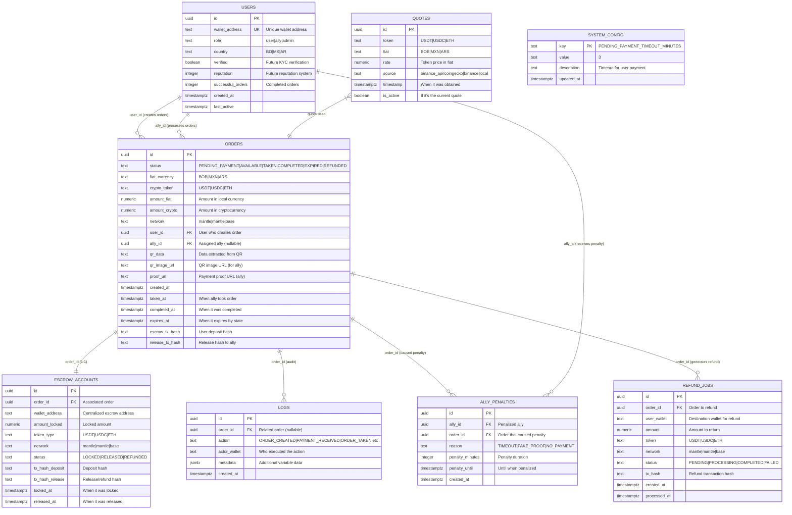
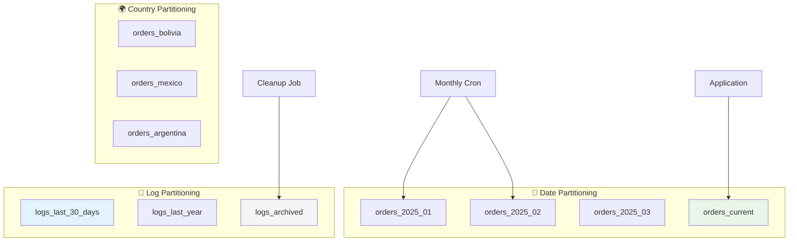
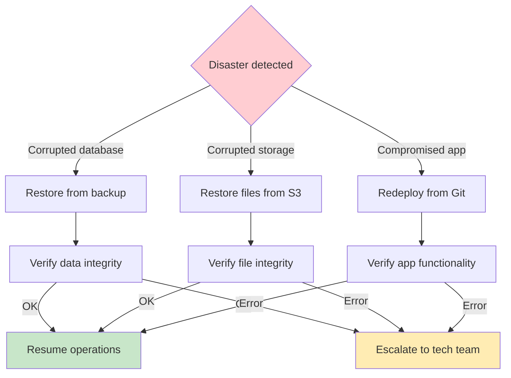

# 🗄️ Kibo - Data Model

## Entity-Relationship Diagram



## Main Table Definitions

### 👤 **USERS - User Management**

| Field | Type | Description | Constraints |
|-------|------|-------------|-------------|
| `id` | UUID | Unique user ID | PRIMARY KEY, DEFAULT gen_random_uuid() |
| `wallet_address` | TEXT | Wallet address (0x...) | UNIQUE, NOT NULL |
| `role` | TEXT | User type | CHECK (role IN ('user', 'ally', 'admin')), DEFAULT 'user' |
| `country` | TEXT | User country | NOT NULL, DEFAULT 'BO' |
| `verified` | BOOLEAN | KYC verification (future) | DEFAULT false |
| `reputation` | INTEGER | Reputation score | DEFAULT 0 |
| `successful_orders` | INTEGER | Successfully completed orders | DEFAULT 0 |
| `created_at` | TIMESTAMPTZ | Registration date | DEFAULT NOW() |
| `last_active` | TIMESTAMPTZ | Last activity | DEFAULT NOW() |

**Indexes:**
```sql
CREATE INDEX idx_users_wallet ON users(wallet_address);
CREATE INDEX idx_users_role_country ON users(role, country);
CREATE INDEX idx_users_active_allies ON users(role, last_active) WHERE role = 'ally';
```

### 📋 **ORDERS - System Central Table**

| Field | Type | Description | Constraints |
|-------|------|-------------|-------------|
| `id` | UUID | Unique order ID | PRIMARY KEY, DEFAULT gen_random_uuid() |
| `status` | TEXT | Current order status | CHECK (status IN ('PENDING_PAYMENT', 'AVAILABLE', 'TAKEN', 'COMPLETED', 'EXPIRED', 'REFUNDED')) |
| `fiat_currency` | TEXT | Fiat currency (BOB, MXN, ARS) | NOT NULL, DEFAULT 'BOB' |
| `crypto_token` | TEXT | Crypto token (USDT, USDC, ETH) | NOT NULL, DEFAULT 'USDT' |
| `amount_fiat` | NUMERIC(10,2) | Amount in fiat currency | NOT NULL, CHECK (amount_fiat > 0) |
| `amount_crypto` | NUMERIC(18,8) | Amount in cryptocurrency | NOT NULL, CHECK (amount_crypto > 0) |
| `network` | TEXT | Blockchain network | NOT NULL, DEFAULT 'mantle' |
| `user_id` | UUID | User who creates the order | NOT NULL, REFERENCES users(id) |
| `ally_id` | UUID | Assigned ally | REFERENCES users(id) |
| `qr_data` | TEXT | Data extracted from QR | NOT NULL |
| `qr_image_url` | TEXT | QR image URL (Supabase Storage) | |
| `proof_url` | TEXT | Proof URL (Supabase Storage) | |
| `created_at` | TIMESTAMPTZ | When it was created | DEFAULT NOW() |
| `taken_at` | TIMESTAMPTZ | When ally took it | |
| `completed_at` | TIMESTAMPTZ | When it was completed | |
| `expires_at` | TIMESTAMPTZ | When it expires (dynamic by state) | NOT NULL |
| `escrow_tx_hash` | TEXT | User deposit hash | |
| `release_tx_hash` | TEXT | Release hash to ally | |

**Critical Indexes:**
```sql
CREATE INDEX idx_orders_status ON orders(status);
CREATE INDEX idx_orders_available ON orders(status, expires_at) WHERE status = 'AVAILABLE';
CREATE INDEX idx_orders_user ON orders(user_id, created_at DESC);
CREATE INDEX idx_orders_ally ON orders(ally_id, taken_at DESC);
CREATE INDEX idx_orders_expires ON orders(expires_at) WHERE status IN ('PENDING_PAYMENT', 'AVAILABLE', 'TAKEN');
CREATE INDEX idx_orders_country ON orders(user_id) INCLUDE (status);
```

### 💱 **QUOTES - Market Quotes**

| Field | Type | Description | Constraints |
|-------|------|-------------|-------------|
| `id` | UUID | Unique quote ID | PRIMARY KEY, DEFAULT gen_random_uuid() |
| `token` | TEXT | Quoted token | NOT NULL |
| `fiat` | TEXT | Reference fiat currency | NOT NULL |
| `rate` | NUMERIC(18,8) | Token price in fiat | NOT NULL, CHECK (rate > 0) |
| `source` | TEXT | Quote source | NOT NULL, DEFAULT 'binance_api/coingecko' |
| `timestamp` | TIMESTAMPTZ | When it was obtained | DEFAULT NOW() |
| `is_active` | BOOLEAN | If it's the current quote | DEFAULT true |

**Indexes:**
```sql
CREATE INDEX idx_quotes_current ON quotes(token, fiat, timestamp DESC) WHERE is_active = true;
CREATE INDEX idx_quotes_history ON quotes(token, fiat, timestamp DESC);
```

### 🏦 **ESCROW_ACCOUNTS - Fund Custody**

| Field | Type | Description | Constraints |
|-------|------|-------------|-------------|
| `id` | UUID | Unique escrow account ID | PRIMARY KEY, DEFAULT gen_random_uuid() |
| `order_id` | UUID | Associated order | NOT NULL, REFERENCES orders(id) ON DELETE CASCADE |
| `wallet_address` | TEXT | Escrow wallet address | NOT NULL |
| `amount_locked` | NUMERIC(18,8) | Locked amount | NOT NULL, CHECK (amount_locked > 0) |
| `token_type` | TEXT | Token type | NOT NULL, DEFAULT 'USDT' |
| `network` | TEXT | Blockchain network | NOT NULL, DEFAULT 'mantle' |
| `status` | TEXT | Escrow status | CHECK (status IN ('LOCKED', 'RELEASED', 'REFUNDED')), DEFAULT 'LOCKED' |
| `tx_hash_deposit` | TEXT | Deposit hash | |
| `tx_hash_release` | TEXT | Release/refund hash | |
| `locked_at` | TIMESTAMPTZ | When it was locked | DEFAULT NOW() |
| `released_at` | TIMESTAMPTZ | When it was released | |

**Indexes:**
```sql
CREATE UNIQUE INDEX idx_escrow_order ON escrow_accounts(order_id);
CREATE INDEX idx_escrow_status ON escrow_accounts(status, locked_at);
CREATE INDEX idx_escrow_wallet ON escrow_accounts(wallet_address, status);
```

### 📝 **LOGS - Complete Audit**

| Field | Type | Description | Constraints |
|-------|------|-------------|-------------|
| `id` | UUID | Unique log ID | PRIMARY KEY, DEFAULT gen_random_uuid() |
| `order_id` | UUID | Related order | REFERENCES orders(id) |
| `action` | TEXT | Executed action | NOT NULL |
| `actor_wallet` | TEXT | Who executed the action | NOT NULL |
| `metadata` | JSONB | Additional information | |
| `created_at` | TIMESTAMPTZ | When it occurred | DEFAULT NOW() |

**Typical Actions:**
- `ORDER_CREATED`, `PAYMENT_RECEIVED`, `ORDER_TAKEN`, `PROOF_UPLOADED`, `ORDER_COMPLETED`, `ORDER_EXPIRED`, `REFUND_PROCESSED`, `ALLY_PENALIZED`

**Indexes:**
```sql
CREATE INDEX idx_logs_order ON logs(order_id, created_at DESC);
CREATE INDEX idx_logs_action ON logs(action, created_at DESC);
CREATE INDEX idx_logs_actor ON logs(actor_wallet, created_at DESC);
CREATE INDEX idx_logs_time ON logs(created_at DESC);
```

### ⚠️ **ALLY_PENALTIES - Penalty System**

| Field | Type | Description | Constraints |
|-------|------|-------------|-------------|
| `id` | UUID | Unique penalty ID | PRIMARY KEY, DEFAULT gen_random_uuid() |
| `ally_id` | UUID | Penalized ally | NOT NULL, REFERENCES users(id) |
| `order_id` | UUID | Order that caused the penalty | REFERENCES orders(id) |
| `reason` | TEXT | Penalty reason | CHECK (reason IN ('TIMEOUT', 'FAKE_PROOF', 'NO_PAYMENT')) |
| `penalty_minutes` | INTEGER | Duration in minutes | NOT NULL, DEFAULT 30 |
| `penalty_until` | TIMESTAMPTZ | Until when penalized | NOT NULL |
| `created_at` | TIMESTAMPTZ | When it was applied | DEFAULT NOW() |

**Indexes:**
```sql
CREATE INDEX idx_penalties_ally ON ally_penalties(ally_id, penalty_until);
CREATE INDEX idx_penalties_active ON ally_penalties(penalty_until) WHERE penalty_until > NOW();
CREATE INDEX idx_penalties_reason ON ally_penalties(reason, created_at DESC);
```

### ⚙️ **SYSTEM_CONFIG - Dynamic Configuration**

| Field | Type | Description | Example |
|-------|------|-------------|---------|
| `key` | TEXT | Configuration key | `PENDING_PAYMENT_TIMEOUT_MINUTES` |
| `value` | TEXT | Configuration value | `3` |
| `description` | TEXT | Description for admins | `Timeout for user payment` |
| `updated_at` | TIMESTAMPTZ | Last modification | DEFAULT NOW() |

**Initial Configurations:**
```sql
INSERT INTO system_config (key, value, description) VALUES
('PENDING_PAYMENT_TIMEOUT_MINUTES', '3', 'Timeout for user payment'),
('AVAILABLE_TIMEOUT_MINUTES', '5', 'Timeout for ally to take order'),
('TAKEN_TIMEOUT_MINUTES', '5', 'Timeout for ally to upload proof'),
('ALLY_PENALTY_MINUTES', '30', 'Minutes of penalty for timeout'),
('QUOTE_UPDATE_INTERVAL_SECONDS', '30', 'Quote update interval'),
('MIN_ORDER_AMOUNT_BOB', '10', 'Minimum order amount in bolivianos'),
('MAX_ORDER_AMOUNT_BOB', '10000', 'Maximum order amount in bolivianos'),
('ESCROW_WALLET_ADDRESS', '0x...', 'Centralized escrow wallet address');
```

### 🔄 **REFUND_JOBS - Automatic Refunds**

| Field | Type | Description | Constraints |
|-------|------|-------------|-------------|
| `id` | UUID | Unique refund ID | PRIMARY KEY, DEFAULT gen_random_uuid() |
| `order_id` | UUID | Order to refund | NOT NULL, REFERENCES orders(id) |
| `user_wallet` | TEXT | Destination wallet for refund | NOT NULL |
| `amount` | NUMERIC(18,8) | Amount to return | NOT NULL, CHECK (amount > 0) |
| `token` | TEXT | Token to return | NOT NULL, DEFAULT 'USDT' |
| `network` | TEXT | Blockchain network | NOT NULL, DEFAULT 'mantle' |
| `status` | TEXT | Refund status | CHECK (status IN ('PENDING', 'PROCESSING', 'COMPLETED', 'FAILED')), DEFAULT 'PENDING' |
| `tx_hash` | TEXT | Refund transaction hash | |
| `created_at` | TIMESTAMPTZ | When the job was created | DEFAULT NOW() |
| `processed_at` | TIMESTAMPTZ | When it was processed | |

**Indexes:**
```sql
CREATE INDEX idx_refund_status ON refund_jobs(status, created_at);
CREATE INDEX idx_refund_pending ON refund_jobs(created_at) WHERE status = 'PENDING';
CREATE UNIQUE INDEX idx_refund_order ON refund_jobs(order_id);
```

## Frontend Optimized Views

### 📋 **available_orders_view - Orders for Allies**

```sql
CREATE VIEW available_orders_view AS
SELECT 
    o.id,
    o.amount_fiat,
    o.amount_crypto,
    o.fiat_currency,
    o.crypto_token,
    o.qr_image_url,
    o.expires_at,
    EXTRACT(EPOCH FROM (o.expires_at - NOW())) AS seconds_remaining,
    u.wallet_address as user_wallet,
    u.country as user_country,
    o.created_at
FROM orders o
JOIN users u ON o.user_id = u.id
WHERE o.status = 'AVAILABLE' 
  AND o.expires_at > NOW()
ORDER BY o.created_at ASC;
```

### 👤 **user_order_summary - User Dashboard**

```sql
CREATE VIEW user_order_summary AS
SELECT 
    o.id,
    o.status,
    o.amount_fiat,
    o.amount_crypto,
    o.fiat_currency,
    o.crypto_token,
    o.created_at,
    o.completed_at,
    ally.wallet_address as ally_wallet,
    CASE 
        WHEN o.status IN ('PENDING_PAYMENT', 'AVAILABLE', 'TAKEN') 
        THEN EXTRACT(EPOCH FROM (o.expires_at - NOW()))
        ELSE NULL 
    END as seconds_remaining,
    CASE o.status
        WHEN 'PENDING_PAYMENT' THEN '⏳ Awaiting your payment'
        WHEN 'AVAILABLE' THEN '🔍 Looking for ally'
        WHEN 'TAKEN' THEN '🤝 Ally processing'
        WHEN 'COMPLETED' THEN '✅ Completed'
        WHEN 'EXPIRED' THEN '❌ Expired'
        WHEN 'REFUNDED' THEN '💰 Refunded'
    END as status_text
FROM orders o
LEFT JOIN users ally ON o.ally_id = ally.id
ORDER BY o.created_at DESC;
```

### 🤝 **ally_dashboard_view - Ally Dashboard**

```sql
CREATE VIEW ally_dashboard_view AS
SELECT 
    a.id as ally_id,
    a.wallet_address,
    COUNT(o.id) as total_orders,
    COUNT(CASE WHEN o.status = 'COMPLETED' THEN 1 END) as completed_orders,
    COUNT(CASE WHEN o.status = 'EXPIRED' AND o.ally_id = a.id THEN 1 END) as expired_orders,
    COALESCE(AVG(EXTRACT(EPOCH FROM (o.completed_at - o.taken_at))/60), 0) as avg_completion_minutes,
    COALESCE(SUM(CASE WHEN o.status = 'COMPLETED' THEN o.amount_crypto ELSE 0 END), 0) as total_earned_usdt,
    -- Orders today
    COUNT(CASE WHEN DATE(o.taken_at) = CURRENT_DATE AND o.status = 'COMPLETED' THEN 1 END) as orders_today,
    COALESCE(SUM(CASE WHEN DATE(o.taken_at) = CURRENT_DATE AND o.status = 'COMPLETED' THEN o.amount_crypto ELSE 0 END), 0) as earned_today,
    -- Current state
    (SELECT COUNT(*) FROM ally_penalties WHERE ally_id = a.id AND penalty_until > NOW()) as is_penalized,
    (SELECT o2.id FROM orders o2 WHERE o2.ally_id = a.id AND o2.status = 'TAKEN' LIMIT 1) as active_order_id
FROM users a
LEFT JOIN orders o ON a.id = o.ally_id
WHERE a.role = 'ally'
GROUP BY a.id, a.wallet_address;
```

### 👨‍💼 **admin_metrics_view - Administrative Metrics**

```sql
CREATE VIEW admin_metrics_view AS
SELECT 
    -- Daily metrics
    COUNT(CASE WHEN DATE(created_at) = CURRENT_DATE THEN 1 END) as orders_today,
    COUNT(CASE WHEN DATE(created_at) = CURRENT_DATE AND status = 'COMPLETED' THEN 1 END) as completed_today,
    COUNT(CASE WHEN DATE(created_at) = CURRENT_DATE AND status = 'EXPIRED' THEN 1 END) as expired_today,
    COALESCE(SUM(CASE WHEN DATE(created_at) = CURRENT_DATE THEN amount_fiat ELSE 0 END), 0) as volume_fiat_today,
    COALESCE(SUM(CASE WHEN DATE(created_at) = CURRENT_DATE THEN amount_crypto ELSE 0 END), 0) as volume_crypto_today,
    
    -- General metrics
    COUNT(*) as total_orders,
    COUNT(CASE WHEN status = 'COMPLETED' THEN 1 END) as total_completed,
    ROUND(COUNT(CASE WHEN status = 'COMPLETED' THEN 1 END) * 100.0 / COUNT(*), 2) as success_rate,
    
    -- Active allies
    (SELECT COUNT(DISTINCT ally_id) FROM orders WHERE DATE(taken_at) = CURRENT_DATE) as active_allies_today,
    (SELECT COUNT(*) FROM users WHERE role = 'ally') as total_allies,
    
    -- Timeouts by state
    COUNT(CASE WHEN status = 'EXPIRED' AND taken_at IS NULL THEN 1 END) as timeouts_available,
    COUNT(CASE WHEN status = 'EXPIRED' AND taken_at IS NOT NULL THEN 1 END) as timeouts_taken
    
FROM orders;
```

## Triggers and Automatic Functions

### 🔄 **Trigger: Auto-logging Changes**

```sql
CREATE OR REPLACE FUNCTION auto_log_order_changes()
RETURNS TRIGGER AS $
BEGIN
    IF TG_OP = 'INSERT' THEN
        INSERT INTO logs (order_id, action, actor_wallet, metadata)
        VALUES (NEW.id, 'ORDER_CREATED', NEW.user_id::text, 
                jsonb_build_object(
                    'amount_fiat', NEW.amount_fiat,
                    'amount_crypto', NEW.amount_crypto,
                    'fiat_currency', NEW.fiat_currency,
                    'crypto_token', NEW.crypto_token
                ));
        RETURN NEW;
    ELSIF TG_OP = 'UPDATE' THEN
        IF OLD.status != NEW.status THEN
            INSERT INTO logs (order_id, action, actor_wallet, metadata)
            VALUES (NEW.id, 'STATUS_CHANGED', 
                    COALESCE(NEW.ally_id::text, NEW.user_id::text),
                    jsonb_build_object(
                        'old_status', OLD.status, 
                        'new_status', NEW.status,
                        'timestamp', NOW()
                    ));
        END IF;
        RETURN NEW;
    END IF;
    RETURN NULL;
END;
$ LANGUAGE plpgsql;

CREATE TRIGGER trigger_auto_log_orders
    AFTER INSERT OR UPDATE ON orders
    FOR EACH ROW
    EXECUTE FUNCTION auto_log_order_changes();
```

### ⏰ **Function: Verify Penalized Ally**

```sql
CREATE OR REPLACE FUNCTION is_ally_penalized(ally_id_param UUID)
RETURNS BOOLEAN AS $
DECLARE
    penalty_count INTEGER;
BEGIN
    SELECT COUNT(*) INTO penalty_count
    FROM ally_penalties
    WHERE ally_id = ally_id_param 
      AND penalty_until > NOW();
    
    RETURN penalty_count > 0;
END;
$ LANGUAGE plpgsql;
```

### 💱 **Function: Get Current Quote**

```sql
CREATE OR REPLACE FUNCTION get_current_rate(token_param TEXT, fiat_param TEXT)
RETURNS NUMERIC AS $
DECLARE
    current_rate NUMERIC;
BEGIN
    SELECT rate INTO current_rate 
    FROM quotes 
    WHERE token = token_param 
      AND fiat = fiat_param 
      AND is_active = true
    ORDER BY timestamp DESC 
    LIMIT 1;
    
    IF current_rate IS NULL THEN
        RAISE EXCEPTION 'No active rate found for % to %', token_param, fiat_param;
    END IF;
    
    RETURN current_rate;
END;
$ LANGUAGE plpgsql;
```

### 📊 **Function: Ally Statistics**

```sql
CREATE OR REPLACE FUNCTION get_ally_stats(ally_id_param UUID)
RETURNS TABLE (
    total_orders INT,
    completed_orders INT,
    success_rate NUMERIC,
    avg_completion_time INTERVAL,
    total_earned NUMERIC,
    penalties_count INT
) AS $
BEGIN
    RETURN QUERY
    SELECT 
        COUNT(o.id)::INT as total_orders,
        COUNT(CASE WHEN o.status = 'COMPLETED' THEN 1 END)::INT as completed_orders,
        ROUND(
            COUNT(CASE WHEN o.status = 'COMPLETED' THEN 1 END) * 100.0 / 
            NULLIF(COUNT(o.id), 0), 2
        ) as success_rate,
        AVG(o.completed_at - o.taken_at) as avg_completion_time,
        COALESCE(SUM(CASE WHEN o.status = 'COMPLETED' THEN o.amount_crypto ELSE 0 END), 0) as total_earned,
        (SELECT COUNT(*)::INT FROM ally_penalties WHERE ally_id = ally_id_param) as penalties_count
    FROM orders o
    WHERE o.ally_id = ally_id_param;
END;
$ LANGUAGE plpgsql;
```

### 🔧 **Function: Get Configuration**

```sql
CREATE OR REPLACE FUNCTION get_config(config_key TEXT)
RETURNS TEXT AS $
DECLARE
    config_value TEXT;
BEGIN
    SELECT value INTO config_value 
    FROM system_config 
    WHERE key = config_key;
    
    IF config_value IS NULL THEN
        RAISE EXCEPTION 'Configuration key % not found', config_key;
    END IF;
    
    RETURN config_value;
END;
$ LANGUAGE plpgsql;
```

## Partitioning Strategy (Future)



## Backup and Recovery

### 📦 **Backup Strategy**

| Component | Frequency | Retention | Method |
|------------|------------|-----------|--------|
| **Active orders** | Real time | 1 year | Supabase Point-in-Time Recovery |
| **Critical logs** | Daily | 90 days | Export to S3 |
| **Configuration** | Weekly | 6 months | Git + Database |
| **Images (QR/Proofs)** | Daily | 1 year | Supabase Storage Backup |

### 🔄 **Recovery Plan**



## Critical Performance Indexes

### ⚡ **Most Important Indexes for Frequent Queries**

```sql
-- For ally dashboard (most frequent query)
CREATE INDEX idx_orders_available_urgent ON orders(status, expires_at, created_at) 
WHERE status = 'AVAILABLE';

-- For user tracking
CREATE INDEX idx_orders_user_recent ON orders(user_id, created_at DESC, status);

-- For timeout automation
CREATE INDEX idx_orders_timeout_check ON orders(expires_at, status) 
WHERE status IN ('PENDING_PAYMENT', 'AVAILABLE', 'TAKEN');

-- For admin dashboard
CREATE INDEX idx_orders_admin_today ON orders(created_at, status) 
WHERE created_at >= CURRENT_DATE;

-- For ally penalties check
CREATE INDEX idx_penalties_active_check ON ally_penalties(ally_id, penalty_until) 
WHERE penalty_until > NOW();

-- For logs performance
CREATE INDEX idx_logs_recent ON logs(created_at DESC, action);
CREATE INDEX idx_logs_order_timeline ON logs(order_id, created_at ASC);
```

### 📊 **Expected Performance Analysis**

| Query Type | Frequency | Expected Time | Key Index |
|------------|------------|-----------------|---------------|
| **View available orders** | Every 10s per ally | < 50ms | `idx_orders_available_urgent` |
| **User dashboard** | Every page load | < 100ms | `idx_orders_user_recent` |
| **Check timeouts** | Every 30s | < 200ms | `idx_orders_timeout_check` |
| **Verify penalties** | Per ally action | < 20ms | `idx_penalties_active_check` |
| **Admin metrics** | Every 30s | < 500ms | `idx_orders_admin_today` |

---

**🎯 Benefits of this Complete Model:**

- **Scalable**: Designed for multiple countries, tokens and networks from day 1
- **Auditable**: Automatic logs and triggers that capture all activity
- **Configurable**: Dynamic system with adjustable parameters without redeploy
- **Performant**: Optimized indexes and materialized views for frequent queries
- **Secure**: Row Level Security, multiple validations, and backup strategy
- **MVP-Ready**: Functional immediately, extensible for future features
- **Resilient**: Automatic recovery functions and edge case handling

**🔑 Final Design Decisions:**
- **UUID everywhere**: Better for distributed systems and security
- **TIMESTAMPTZ**: Multi-timezone support prepared from start  
- **JSONB for metadata**: Flexibility without sacrificing performance
- **Specialized views**: Optimization for specific use cases
- **Automatic triggers**: Data consistency without additional logic in application
- **Partitioning strategy**: Ready to scale to millions of orders----------
