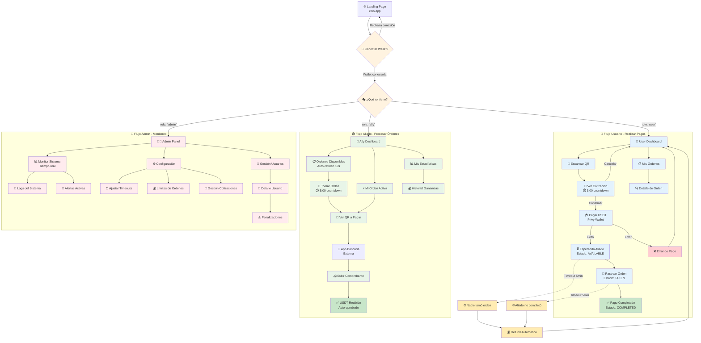
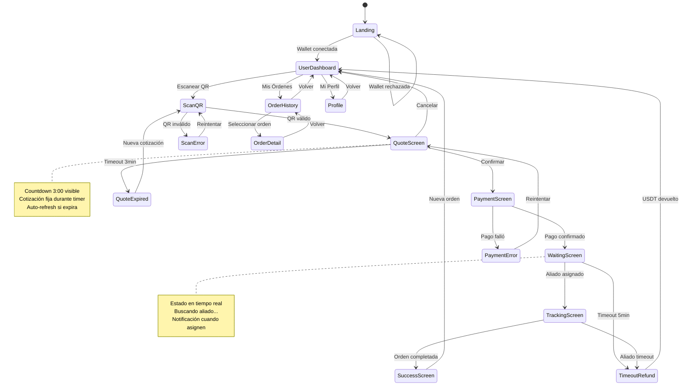
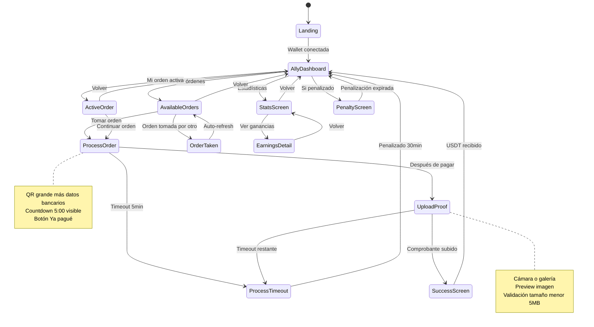
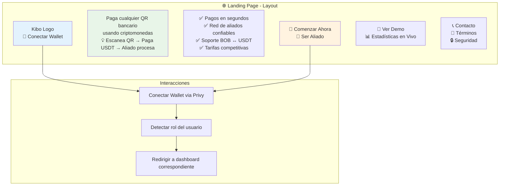

# 🎨 Kibo - Navegación y Experiencia de Usuario

## Mapa de Navegación General

## Estados de Navegación por Pantalla

### 📱 **App Estado Usuario**

### 🤝 **App Estado Aliado**

## Pantallas Detalladas por Tipo de Usuario

### 🌐 **Landing Page (Punto de Entrada)**

### 👤 **User Dashboard - Panel Principal**

```mermaid
graph TB
    subgraph "User Dashboard Mobile First"
        NAV[Inicio - Órdenes - Perfil - Logout]
        
        subgraph "Balance Card"
            BALANCE[Mi Balance 250.00 USDT - Red Polygon]
            REFRESH_BALANCE[Actualizar Balance]
        end
        
        subgraph "Nueva Orden Card Principal"
            QR_BTN[Escanear QR para Pagar]
            OR_TEXT[--- O ---]
            MANUAL_BTN[Ingresar datos manualmente - Próximamente]
        end
        
        subgraph "Órdenes Recientes Card"
            RECENT_HEADER[Mis Órdenes Recientes]
            ORDER1[150 BOB - 21.5 USDT - Completado]
            ORDER2[200 BOB - 28.7 USDT - En proceso]
            ORDER3[100 BOB - 14.3 USDT - Expirado]
            VIEW_ALL[Ver todas mis órdenes]
        end
        
        subgraph "Estadísticas Personales"
            STATS[Total procesado 1250 BOB - Ahorrado en fees 5 porciento]
        end
        
        subgraph "Estado del Sistema"
            SYSTEM_STATUS[Sistema operativo - 12 aliados activos]
        end
    end
    
    %% Interacciones
    QR_BTN --> SCAN_QR_FLOW[Flujo escanear QR]
    ORDER1 --> ORDER_DETAIL[Ver detalle orden]
    ORDER2 --> ORDER_TRACKING[Seguimiento en tiempo real]
    ORDER3 --> ORDER_DETAIL
    VIEW_ALL --> ORDER_HISTORY[Lista completa órdenes]
    
    style QR_BTN fill:#4caf50,color:#fff
    style ORDER2 fill:#fff3e0
    style SYSTEM_STATUS fill:#e8f5e8
```

