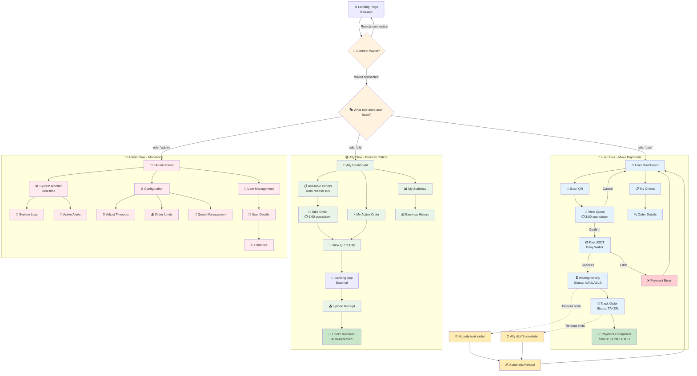
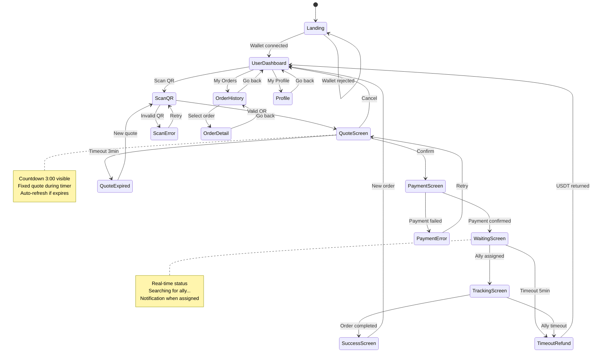
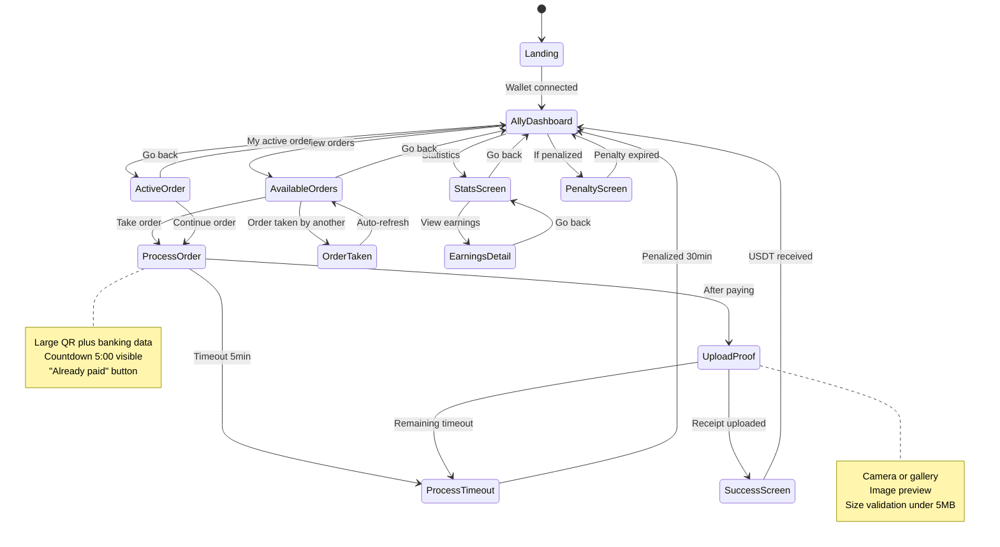
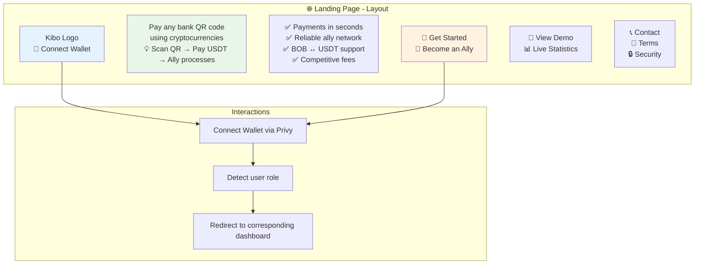

# 🎨 Kibo - Navigation and User Experience

## General Navigation Map

## Navigation States by Screen

### 📱 **User App State**

### 🤝 **Ally App State**

## Detailed Screens by User Type

### 🌐 **Landing Page (Entry Point)**

### 👤 **User Dashboard - Main Panel**

```mermaid
graph TB
    subgraph "User Dashboard Mobile First"
        NAV[Home - Orders - Profile - Logout]
        
        subgraph "Balance Card"
            BALANCE[My Balance 250.00 USDT - Mantle network]
            REFRESH_BALANCE[Refresh Balance]
        end
        
        subgraph "New Order Main Card"
            QR_BTN[Scan QR to Pay]
            OR_TEXT[--- OR ---]
            MANUAL_BTN[Enter data manually - Coming Soon]
        end
        
        subgraph "Recent Orders Card"
            RECENT_HEADER[My Recent Orders]
            ORDER1[150 BOB - 21.5 USDT - Completed]
            ORDER2[200 BOB - 28.7 USDT - In Progress]
            ORDER3[100 BOB - 14.3 USDT - Expired]
            VIEW_ALL[View all my orders]
        end
        
        subgraph "Personal Statistics"
            STATS[Total processed 1250 BOB - Saved in fees 5 percent]
        end
        
        subgraph "System Status"
            SYSTEM_STATUS[System operational - 12 active allies]
        end
    end
    
    %% Interactions
    QR_BTN --> SCAN_QR_FLOW[Scan QR flow]
    ORDER1 --> ORDER_DETAIL[View order details]
    ORDER2 --> ORDER_TRACKING[Real-time tracking]
    ORDER3 --> ORDER_DETAIL
    VIEW_ALL --> ORDER_HISTORY[Complete order list]
    
    style QR_BTN fill:#4caf50,color:#fff
    style ORDER2 fill:#fff3e0
    style SYSTEM_STATUS fill:#e8f5e8
```

