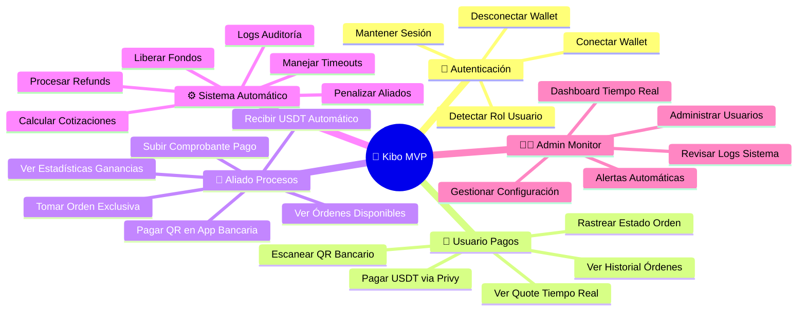

# 📋 Kibo - Casos de Uso y User Stories

## Épicas Principales del MVP



## 🔐 ÉPICA 1: Autenticación y Gestión de Sesiones

### **US001: Conectar Wallet como Usuario**
```gherkin
Como usuario nuevo
Quiero conectar mi wallet crypto
Para poder realizar pagos con mis criptomonedas

DADO que estoy en la landing page de Kibo
CUANDO hago clic en "Conectar Wallet"  
ENTONCES se abre Privy para seleccionar mi wallet
Y puedo conectar MetaMask, WalletConnect, Coinbase Wallet
Y el sistema detecta mi dirección de wallet automáticamente
Y se crea mi perfil como role="user" en la base de datos
Y soy redirigido al User Dashboard
Y veo mi balance de USDT actualizado

Flujos de Error:
❌ SI rechazo la conexión → Regreso a landing con mensaje
❌ SI mi wallet no tiene USDT → Warning pero puedo continuar
❌ SI hay error de red → Mensaje "Intenta de nuevo" con retry

Criterios Técnicos:
✅ Usar Privy SDK para autenticación
✅ Guardar wallet_address en tabla users
✅ Generar JWT token para sesión
✅ Verificar balance USDT en mantle
✅ Manejar estados: loading, success, error

Estimación: 2 días
Prioridad: Crítica
Dependencias: Configuración Privy + Supabase
```

### **US002: Conectar Wallet como Aliado**
```gherkin
Como persona interesada en ser aliado
Quiero registrarme como aliado de Kibo
Para poder ganar USDT procesando pagos de otros usuarios

DADO que estoy en la landing page
CUANDO hago clic en "Ser Aliado"
ENTONCES conecto mi wallet igual que usuario normal
Y lleno formulario adicional:
  - País de operación (Bolivia por ahora)
  - Bancos que manejo (Banco Unión, BNB, etc.)
  - Acepto términos específicos de aliados
Y mi rol se marca como role="ally" en base de datos
Y soy redirigido al Ally Dashboard
Y veo las órdenes disponibles inmediatamente

Validaciones Específicas:
✅ Wallet no puede estar ya registrada como otro rol
✅ País debe estar en lista de países soportados
✅ Debe tener mínimo 1 USDT para verificar wallet funcional
✅ Formulario debe validar datos bancarios

Estimación: 3 días  
Prioridad: Crítica
Dependencias: US001 completado
```

### **US003: Mantener Sesión Activa**
```gherkin
Como usuario autenticado (user o ally)
Quiero que mi sesión se mantenga activa
Para no tener que reconectarme constantemente

DADO que ya conecté mi wallet
CUANDO cierro y reabro la aplicación
O cuando navego entre páginas
ENTONCES mi sesión se mantiene activa automáticamente
Y no necesito reconectar wallet
Y mis datos se cargan automáticamente
Y mi role se detecta correctamente

Casos Especiales:
✅ Sesión expira después de 7 días de inactividad
✅ Si cambio de wallet address → forzar re-autenticación
✅ Si hay error en token JWT → logout automático

Estimación: 1 día
Prioridad: Alta
```

## 👤 ÉPICA 2: Usuario - Realizar Pagos Crypto-to-Fiat

### **US004: Escanear QR Bancario para Pagar**
```gherkin
Como usuario con USDT
Quiero escanear un QR de pago bancario
Para pagarlo usando mis criptomonedas

DADO que estoy en User Dashboard
CUANDO hago clic en "Escanear QR"
ENTONCES se abre la cámara nativa del dispositivo
Y puedo escanear cualquier QR de pago bancario boliviano
Y el sistema extrae automáticamente:
  - Banco de destino
  - Cuenta o referencia
  - Cualquier metadata disponible
Y me permite ingresar el monto manualmente en BOB
Y valida que el monto esté entre 10-10,000 BOB
Y procede automáticamente a calcular quote

Casos Edge Manejados:
❌ QR no válido o corrupto → "QR no reconocido, intenta otro"
❌ Cámara no disponible → Opción de subir imagen desde galería
❌ Monto fuera de rango → "Monto debe estar entre 10-10,000 BOB"
❌ QR de otro país → "Solo QRs bancarios de Bolivia soportados"

Criterios Técnicos:
✅ Usar API nativa de cámara del browser
✅ Parsear múltiples formatos de QR bancarios bolivianos
✅ Validación client-side y server-side de montos
✅ Fallback a upload manual si cámara falla

Estimación: 4 días
Prioridad: Crítica
Dependencias: Investigación formatos QR bancarios Bolivia
```

### **US005: Ver Quote y Confirmar Pago**
```gherkin
Como usuario que escaneó QR válido
Quiero ver el quote exacto antes de pagar
Para decidir si procedo con la transacción

DADO que escaneé un QR válido y ingresé monto BOB
CUANDO el sistema calcula el quote
ENTONCES veo en pantalla clara:
  - Monto en BOB que quiero pagar
  - Quote USDT/BOB actual y fuente
  - Monto exacto en USDT que pagaré
  - Fee de red estimado en USDT
  - Total final exacto
  - Countdown timer 3:00 para decidir
Y puedo confirmar o cancelar la transacción
Y si no decido en 3 minutos, se actualiza quote automáticamente

Validaciones en Tiempo Real:
✅ Verificar que tengo suficiente USDT en wallet
✅ Confirmar que quote no es más antiguo de 30 segundos
✅ Validar que red mantle está operativa
✅ Mostrar advertencia si balance insuficiente

Flujos Posibles:
✅ Confirmar → Proceder a flujo de pago
✅ Cancelar → Volver a dashboard sin crear orden
✅ Timeout → Recalcular quote automáticamente
✅ Insufficient funds → Mostrar error + sugerir conseguir más USDT

Estimación: 3 días
Prioridad: Crítica
Dependencias: US004 + integración quote API
```

### **US006: Pagar USDT al Escrow Centralizado**
```gherkin
Como usuario que confirmó quote
Quiero transferir mis USDT de forma segura
Para que un aliado procese mi pago fiat

DADO que confirmé el quote mostrado
CUANDO hago clic en "Confirmar y Pagar"
ENTONCES Privy abre mi wallet conectada
Y veo los detalles exactos de la transacción:
  - Destinatario: dirección escrow de Kibo
  - Monto: cantidad exacta USDT calculada
  - Network: mantle
  - Estimated gas fee
Y confirmo la transacción en mi wallet
Y el sistema detecta el pago en blockchain
Y mi orden se marca como status="AVAILABLE"
Y veo "Buscando aliado disponible..." con spinner

Estados de Loading Claros:
🔄 "Confirmando transacción..." (hasta confirmar en blockchain)
🔄 "Transacción pendiente..." (esperando confirmaciones)
🔄 "Buscando aliado..." (hasta que alguien tome la orden)

Errores Manejados:
❌ Transacción rechazada por usuario → Volver a quote
❌ Insufficient gas fee → "Necesitas más ETH para gas"
❌ Network congestion → "Red congestionada, reintentando..."
❌ Transaction failed → "Error en transacción, intenta de nuevo"

Criterios Técnicos:
✅ Integrar con Privy para manejo de transacciones
✅ Escuchar eventos de blockchain para confirmación
✅ Crear registro en tabla orders con status="PENDING_PAYMENT"
✅ Actualizar a "AVAILABLE" cuando se confirme pago
✅ Configurar webhook o polling para detectar transacciones

Estimación: 5 días
Prioridad: Crítica
Dependencias: US005 + configuración wallet escrow
```

### **US007: Rastrear Estado de Mi Orden en Tiempo Real**
```gherkin
Como usuario que ya pagó su orden
Quiero ver el progreso de mi pago en tiempo real
Para saber cuándo estará completado

DADO que ya transferí USDT al escrow
CUANDO estoy en la pantalla de seguimiento de orden
ENTONCES veo actualizaciones automáticas cada 10 segundos:
  - ⏳ "Buscando aliado disponible..." (status=AVAILABLE)
  - 👤 "Aliado Juan (0x56...78) asignado" (status=TAKEN)  
  - 💳 "Aliado procesando pago bancario..." (status=TAKEN)
  - ✅ "¡Pago completado exitosamente!" (status=COMPLETED)
Y veo countdown de timeouts restantes cuando aplique
Y recibo notificaciones push en momentos clave
Y puedo ver detalles expandidos de la orden

Información Mostrada por Estado:
📋 AVAILABLE: "Buscando aliado... (⏱️ expira en 4:30)"
🤝 TAKEN: "Aliado procesando... (⏱️ debe completar en 3:15)"
✅ COMPLETED: "Pago completado - aliado recibió USDT"
❌ EXPIRED: "Orden expiró - USDT devuelto a tu wallet"

Notificaciones Push:
🔔 Aliado asignado a tu orden
🔔 Pago completado exitosamente  
🔔 Orden expirada - USDT reembolsado

Estimación: 3 días
Prioridad: Alta
Dependencias: US006 + Supabase Realtime + notificaciones
```

### **US008: Ver Historial de Mis Órdenes**
```gherkin
Como usuario que ha hecho varios pagos
Quiero ver el historial completo de mis órdenes
Para revisar transacciones pasadas y gestionar activas

DADO que estoy logueado en User Dashboard
CUANDO navego a "Mis Órdenes"
ENTONCES veo lista paginada de todas mis órdenes:
  - Estado actual con íconos claros
  - Monto en BOB y USDT pagado
  - Fecha y hora de creación
  - Duración total del proceso
  - Aliado que la procesó (si completada)
Y puedo filtrar por estado: Todas, Activas, Completadas, Expiradas
Y puedo ver detalles completos de cada orden
Y puedo exportar mi historial en CSV

Detalles por Orden:
📋 ID orden, timestamps, montos, quote usado
🤝 Info del aliado (si asignado)
⛓️ Hashes de transacciones blockchain
📄 Comprobante de pago (si completada)

Estimación: 2 días
Prioridad: Media
Dependencias: US007 completado
```

## 🤝 ÉPICA 3: Aliado - Procesar Órdenes y Ganar USDT

### **US009: Ver Órdenes Disponibles para Procesar**
```gherkin
Como aliado registrado
Quiero ver las órdenes que puedo procesar
Para elegir cuáles tomar según mi capacidad

DADO que estoy logueado como aliado
CUANDO accedo a mi dashboard
ENTONCES veo sección "Órdenes Disponibles" que se actualiza cada 10s
Y veo para cada orden disponible:
  - Monto en BOB a pagar
  - Mi ganancia exacta en USDT
  - Tiempo restante antes de expirar
  - Banco de destino
  - Botón "TOMAR" prominente
Y veo solo órdenes que puedo procesar:
  - De mi país (Bolivia)
  - Que no estén tomadas por otro aliado
  - Solo si no tengo orden activa
  - Solo si no estoy penalizado
Y las órdenes se ordenan por urgencia (más cercanas a expirar primero)

Filtros Automáticos:
✅ Solo órdenes con status="AVAILABLE"
✅ Solo de mi country="BO"
✅ Solo si mi ally_id no está en otra orden TAKEN
✅ Solo si no tengo penalizaciones activas
✅ Excluir órdenes que dejé expirar antes

Estados Especiales:
📭 Si no hay órdenes: "No hay órdenes disponibles - te notificaremos"
🚫 Si estoy penalizado: "Penalizado hasta 15:30 - no puedes tomar órdenes"
⚡ Si tengo orden activa: "Completa tu orden actual antes de tomar otra"

Estimación: 3 días
Prioridad: Crítica
Dependencias: US001, US002 + tabla ally_penalties
```

### **US010: Tomar Orden Disponible Exclusivamente**
```gherkin
Como aliado viendo órdenes disponibles
Quiero tomar una orden específica
Para ganar USDT procesándola exclusivamente

DADO que veo una orden disponible
CUANDO hago clic en "TOMAR ORDEN"
ENTONCES la orden se asigna exclusivamente a mí (ally_id)
Y el status cambia de "AVAILABLE" a "TAKEN"
Y otros aliados ya no pueden verla ni tomarla
Y soy redirigido a pantalla de procesamiento
Y veo todos los detalles para procesar el pago:
  - QR code grande y claro para escanear
  - Datos bancarios para copiar manualmente
  - Monto exacto a pagar en BOB
  - Referencia única para la transferencia
  - Countdown timer 5:00 para completar
Y la orden expires_at se actualiza a NOW() + 5 minutos

Validaciones al Tomar:
❌ Si alguien más la tomó 1 segundo antes → "Orden ya tomada por otro aliado"
❌ Si estoy penalizado → "No puedes tomar órdenes mientras estés penalizado"
❌ Si ya tengo orden activa → "Completa tu orden actual primero"
❌ Si la orden expiró → "Esta orden ya expiró"

Información Mostrada:
📱 QR code optimizado para scan móvil
🏦 Banco: Unión | Cuenta: 123456789 | Referencia: KBO025
💰 Monto exacto: 300.00 BOB
⏰ Tiempo límite: 5:00 countdown
🎯 Mi ganancia: 43.06 USDT

Estimación: 4 días
Prioridad: Crítica
Dependencias: US009 + manejo concurrencia base de datos
```

### **US011: Pagar QR en App Bancaria Externa**
```gherkin
Como aliado que tomó una orden
Quiero instrucciones claras para pagar el QR
Para completar el proceso eficientemente

DADO que tomé una orden y estoy en pantalla de procesamiento
CUANDO veo los detalles del pago a realizar
ENTONCES tengo opciones claras para procesar:
  - QR code grande para escanear con mi app bancaria
  - Datos bancarios para copiar/pegar manualmente
  - Botón "Copiar datos" que copia al clipboard
  - Instrucciones paso a paso claras
  - Botón "Abrir app bancaria" (si es posible)
Y puedo alternar entre vista QR y vista datos textuales
Y veo countdown prominente del tiempo restante
Y hay botón "Ya pagué - Subir comprobante" para siguiente paso

Flujo Esperado del Aliado:
1. Ver QR/datos en Kibo
2. Abrir app bancaria (externa a Kibo)  
3. Escanear QR o ingresar datos manualmente
4. Realizar transferencia bancaria
5. Recibir confirmación del banco
6. Regresar a Kibo
7. Subir foto del comprobante

Ayudas UX:
📱 QR optimizado para cámaras móviles
📋 "Copiar datos" funciona en todos los browsers
🔄 Botón refresh por si QR no carga
⏰ Warning cuando quedan < 1 minuto
📞 Enlace a soporte si hay problemas

Estimación: 2 días
Prioridad: Alta
Dependencias: US010 + investigación deep linking apps bancarias
```

### **US012: Subir Comprobante de Pago**
```gherkin
Como aliado que ya pagó el QR bancario
Quiero subir el comprobante de mi transferencia
Para recibir mis USDT automáticamente

DADO que ya realicé el pago bancario
CUANDO regreso a Kibo y hago clic en "Subir Comprobante"
ENTONCES puedo:
  - Tomar foto directamente con cámara
  - Seleccionar imagen existente de galería
  - Ver preview de la imagen antes de enviar
  - Confirmar que se lee claramente:
    * Monto transferido (debe coincidir)
    * Fecha y hora del pago
    * Banco y cuenta destino
    * Referencia de la transferencia
Y el sistema valida la imagen:
  - Tamaño < 5MB
  - Formato JPG o PNG
  - No está corrupta
Y al enviar, el comprobante se sube a Supabase Storage
Y automáticamente la orden se marca como status="COMPLETED"
Y recibo confirmación: "USDT enviado a tu wallet"

Validaciones de Imagen:
✅ Tamaño máximo 5MB
✅ Formatos permitidos: JPG, PNG, HEIC
✅ Imagen no puede estar completamente negra/blanca
✅ Debe tener dimensiones mínimas (ej: 200x200px)

MVP: Auto-aprobación
🤖 Comprobante subido = Aprobación automática inmediata
🚫 Sin verificación manual por ahora
📝 Logs completos para auditoría futura

Post-upload:
✅ USDT transferido inmediatamente al wallet del aliado
✅ Estadísticas del aliado actualizadas (+1 successful_order)
✅ Notificaciones enviadas a usuario y aliado
✅ Orden marcada como completada con timestamp

Estimación: 3 días
Prioridad: Crítica
Dependencias: US011 + Supabase Storage + auto-aprobación logic
```

### **US013: Ver Mis Estadísticas y Ganancias**
```gherkin
Como aliado que ha procesado órdenes
Quiero ver mis estadísticas de rendimiento
Para monitorear mis ganancias y mejorar mi servicio

DADO que soy aliado con órdenes procesadas
CUANDO navego a mi sección "Estadísticas"
ENTONCES veo dashboard con:

Métricas del Día:
- Órdenes completadas hoy
- USDT ganado hoy  
- Tiempo promedio de procesamiento
- Órdenes disponibles vs tomadas

Métricas Históricas:
- Total órdenes completadas
- Total USDT ganado
- Tasa de éxito (completadas vs expiradas)
- Tiempo promedio histórico
- Tendencia de ganancias (gráfico semanal)

Estado Actual:
- ¿Tengo penalizaciones activas?
- ¿Tengo orden activa pendiente?
- Mi reputación (futuro)
- Ranking vs otros aliados (futuro)

Detalles Útiles:
📊 Gráfico de ganancias por día/semana
⏰ Análisis de mejores horarios para estar activo
🏆 Badges por hitos (ej: "100 órdenes completadas")
💡 Tips para mejorar velocidad de procesamiento

Estimación: 2 días
Prioridad: Media
Dependencias: US012 + ally_dashboard_view en BD
```

## ⚙️ ÉPICA 4: Sistema Automático - Backbone del MVP

### **US014: Calcular y Actualizar Cotizaciones Automáticamente**
```gherkin
Como sistema de Kibo
Quiero mantener cotizaciones USDT/BOB actualizadas
Para ofrecer precios justos y competitivos a usuarios

DADO que el sistema está operando
CUANDO pasan 30 segundos desde la última actualización
ENTONCES ejecuto job automático que:
  - Consulta binance_api/coingecko API para precio USDT/USD actual
  - Consulta fuente confiable para tasa USD/BOB
  - Calcula tasa USDT/BOB resultante
  - Guarda nuevo quote en tabla quotes
  - Marca quote anterior como is_active=false
Y las nuevas órdenes usan automáticamente el quote más reciente
Y las órdenes en progreso mantienen su quote fijo original

Manejo de Errores:
❌ API externa no responde → Usar último quote válido + log warning
❌ Cambio > 5% vs precio anterior → Log alerta para admin review
❌ No hay quote en últimos 10 min → Bloquear creación nuevas órdenes

Fuentes de Datos:
🔧 Primaria: binance_api/coingecko API (gratis, confiable)
🔧 Fallback: CoinMarketCap API
🔧 Tasa BOB: Banco Central Bolivia o servicio financiero local

Implementación Técnica:
✅ Vercel Cron Job cada 30 segundos
✅ Next.js API route: /api/cron/update-quotes
✅ Retry automático 3 veces si falla
✅ Logs en tabla quotes para auditoría

Estimación: 3 días
Prioridad: Crítica
Dependencias: Investigación APIs quotes + configuración cron jobs
```

### **US015: Manejar Timeouts y Expiraciones Automáticamente**
```gherkin
Como sistema de Kibo
Quiero procesar órdenes expiradas automáticamente
Para mantener el flujo sin intervención manual

DADO que ejecuto job de limpieza cada 30 segundos
CUANDO encuentro órdenes con expires_at < NOW()
ENTONCES según el estado de cada orden:

PENDING_PAYMENT expirada (3+ minutos):
- Cambiar status a "EXPIRED"
- Eliminar orden (no hay fondos que devolver)
- Log: "Order {id} expired in PENDING_PAYMENT"
- Notificar usuario: "Tu orden expiró sin pagar"

AVAILABLE expirada (5+ minutos):
- Cambiar status a "EXPIRED"  
- Crear refund_job para devolver USDT al usuario
- Ejecutar refund automático via wallet escrow
- Log: "Order {id} expired in AVAILABLE, refund processed"
- Notificar usuario: "Orden expiró, USDT devuelto"

TAKEN expirada (5+ minutos):
- Cambiar status a "EXPIRED"
- Crear ally_penalty para el aliado (30 min block)
- Crear refund_job para devolver USDT al usuario
- Log: "Order {id} expired in TAKEN, ally {id} penalized"
- Notificar usuario: "Orden expiró, USDT devuelto"  
- Notificar aliado: "Orden expiró, penalizado 30 minutos"

Todos los timeouts:
✅ Se registran en tabla logs con metadata completa
✅ Métricas agregadas para dashboard admin
✅ Alertas automáticas si > 30% órdenes expiran

Implementación:
✅ Vercel Cron Job: /api/cron/check-timeouts
✅ Función SQL optimizada para encontrar expiradas
✅ Transacciones atómicas para evitar race conditions
✅ Idempotencia para múltiples ejecuciones

Estimación: 4 días
Prioridad: Crítica
Dependencias: US014 + refund system + penalty system
```

### **US016: Procesar Refunds Automáticamente**
```gherkin
Como sistema de Kibo
Quiero devolver USDT automáticamente cuando algo falla
Para que usuarios nunca pierdan dinero por problemas del sistema

DADO que una orden expira con fondos en escrow (AVAILABLE o TAKEN)
CUANDO el sistema detecta la expiración
ENTONCES ejecuto proceso de refund automático:
  - Crear registro en tabla refund_jobs con status="PENDING"
  - Transferir USDT desde wallet escrow al wallet original del usuario
  - Esperar confirmación de transacción en blockchain
  - Marcar refund_job como status="COMPLETED"
  - Actualizar escrow_account como status="REFUNDED"
  - Registrar tx_hash de la transacción refund
  - Enviar notificación push al usuario
Y todo el proceso es completamente automático
Y se registra hash de transacción para verificación

Validaciones de Seguridad:
✅ Solo refund si hay fondos confirmados en escrow
✅ Solo una vez por orden (idempotencia)
✅ Verificar saldo suficiente en wallet escrow antes de transferir
✅ Timeout del refund job si no se procesa en 10 minutos

Estados del Refund Job:
📋 PENDING: Creado, esperando procesamiento
🔄 PROCESSING: Transacción enviada, esperando confirmación
✅ COMPLETED: USDT devuelto exitosamente  
❌ FAILED: Error en el proceso, requiere intervención manual

Manejo de Errores:
❌ Wallet escrow sin fondos → Alerta crítica admin
❌ Network down → Reintentar cada 5 minutos
❌ Transaction failed → Marcar como FAILED + alerta admin

Estimación: 3 días
Prioridad: Alta
Dependencias: US015 + configuración wallet escrow para envíos
```

### **US017: Liberar Fondos al Aliado Automáticamente**
```gherkin
Como sistema de Kibo
Quiero transferir USDT al aliado cuando complete correctamente
Para automatizar el pago sin intervención manual

DADO que un aliado sube comprobante válido
CUANDO la orden se marca como status="COMPLETED"
ENTONCES ejecuto liberación automática de fondos:
  - Transferir USDT desde wallet escrow al wallet del aliado
  - Marcar escrow_account como status="RELEASED"
  - Registrar tx_hash de la transacción de liberación
  - Incrementar successful_orders del aliado en +1
  - Actualizar last_active del aliado a NOW()
  - Enviar notificaciones push a aliado y usuario
  - Registrar en logs: "Funds released to ally"
Y el proceso es inmediato tras subir comprobante (MVP auto-approval)

Validaciones Antes de Liberar:
✅ Orden debe estar en status="TAKEN" → "COMPLETED"
✅ ally_id debe coincidir con quien tomó la orden
✅ Debe haber fondos suficientes en escrow
✅ proof_url debe existir y ser válida
✅ No debe haberse liberado antes (idempotencia)

MVP: Auto-liberación Inmediata
🤖 Comprobante subido = Liberación automática sin verificación
🚫 Sin review manual en esta etapa
📊 Métricas para detectar patrones sospechosos después

Post-liberación:
✅ Usuario notificado: "Pago completado exitosamente"
✅ Aliado notificado: "43.06 USDT enviado a tu wallet"
✅ Estadísticas actualizadas en tiempo real
✅ Aliado queda disponible para tomar nueva orden

Estimación: 3 días
Prioridad: Crítica
Dependencias: US012 + wallet escrow configurado para envíos
```

## 👨‍💼 ÉPICA 5: Admin - Monitoreo y Configuración

### **US018: Dashboard de Monitoreo en Tiempo Real**
```gherkin
Como administrador del sistema
Quiero ver el estado operativo de Kibo en tiempo real
Para detectar problemas y supervisar el rendimiento

DADO que accedo al admin panel con rol="admin"
CUANDO veo el dashboard principal
ENTONCES veo métricas actualizadas cada 30 segundos:

Métricas del Día Actual:
- Total órdenes creadas hoy
- Órdenes completadas vs expiradas  
- Volumen en BOB y USDT procesado
- Número de aliados únicos activos
- Tiempo promedio de procesamiento
- Tasa de éxito general

Estado del Sistema:
- Uptime de la aplicación
- Estado de APIs externas (binance_api/coingecko, etc.)
- Saldo del wallet escrow
- Órdenes en cada estado (gráfico en tiempo real)
- Alertas activas del sistema

Últimas Órdenes (Live Feed):
- 10 órdenes más recientes con estado actual
- Posibilidad de drill-down en cualquier orden
- Filtros por estado, usuario, aliado, fecha

Alertas Automáticas Configuradas:
🚨 > 30% órdenes expirando en la última hora
🚨 Aliado con 3+ timeouts seguidos  
🚨 API de cotizaciones sin responder > 5 minutos
🚨 Wallet escrow con saldo < 100 USDT
🚨 Sistema con > 10% error rate

Estimación: 4 días
Prioridad: Media
Dependencias: admin_metrics_view + alerting system
```

### **US019: Gestionar Configuración del Sistema Dinámicamente**
```gherkin
Como administrador
Quiero ajustar parámetros del sistema sin redeploy
Para optimizar la operación según datos reales

DADO que estoy en sección "Configuración" del admin panel
CUANDO edito parámetros operativos
ENTONCES puedo modificar en tiempo real:

Timeouts (en minutos):
- PENDING_PAYMENT_TIMEOUT: 3 → editable
- AVAILABLE_TIMEOUT: 5 → editable  
- TAKEN_TIMEOUT: 5 → editable
- ALLY_PENALTY_DURATION: 30 → editable

Límites de Órdenes:
- MIN_ORDER_AMOUNT_BOB: 10 → editable
- MAX_ORDER_AMOUNT_BOB: 10000 → editable
- MAX_DAILY_ORDERS_PER_USER: sin límite → configurable

Parámetros de Quotes:
- QUOTE_UPDATE_INTERVAL_SECONDS: 30 → editable
- PRICE_CHANGE_ALERT_THRESHOLD: 5% → editable
- QUOTE_SOURCE: binance_api/coingecko → seleccionable

Y todos los cambios aplican inmediatamente sin reiniciar
Y se registra quién cambió qué parámetro y cuándo
Y hay validaciones para evitar configuraciones problemáticas

Validaciones de Configuración:
✅ Timeouts mínimo 1 minuto, máximo 60 minutos
✅ Límites coherentes (min < max)
✅ Solo valores numéricos positivos donde corresponde
✅ Cambios críticos requieren confirmación adicional

Historial de Cambios:
📝 Log completo de quién cambió qué configuración
📅 Posibilidad de revertir a configuración anterior
⚠️ Alertas si configuración causa problemas operativos

Estimación: 2 días
Prioridad: Baja
Dependencias: system_config table + validation functions
```

### **US020: Administrar Usuarios y Penalizaciones**
```gherkin
Como administrador
Quiero gestionar usuarios problemáticos
Para mantener la calidad del servicio

DADO que estoy en sección "Gestión de Usuarios"
CUANDO reviso la lista de usuarios/aliados
ENTONCES puedo:

Ver Información Detallada:
- Lista de todos los usuarios con filtros por rol
- Estadísticas de cada aliado (éxito, timeouts, ganancias)
- Historial completo de órdenes por usuario
- Penalizaciones activas y históricas
- Actividad reciente y patrones de uso

Acciones sobre Aliados Problemáticos:
- Ver detalle de timeouts y razones
- Extender penalización manual (ej: de 30min a 2 horas)
- Bloquear aliado temporalmente (ej: 24 horas)
- Marcar aliado como "bajo revisión"
- Ver todas las órdenes que procesó con detalles

Casos de Uso Típicos:
🔍 Aliado con patrón de muchos timeouts
🔍 Usuario con comportamiento sospechoso (muchas órdenes canceladas)
🔍 Verificar legitimidad de comprobantes específicos
🔍 Investigar quejas o problemas reportados

Reportes Generables:
📊 Aliados más efectivos del mes
📊 Usuarios con mayor volumen
📊 Análisis de timeouts por horario/día
📊 Tendencias de crecimiento de usuarios

Limitaciones MVP:
🚫 No editar datos de usuarios directamente
🚫 No eliminar órdenes completadas
✅ Solo gestión de penalizaciones y monitoreo
✅ Logs completos de todas las acciones admin

Estimación: 3 días
Prioridad: Baja
Dependencias: US018 + ally_penalties management
```

## 🚨 ÉPICA 6: Manejo de Errores y Casos Edge

### **US021: Manejar Fallos de Red Blockchain Graciosamente**
```gherkin
Como sistema resiliente
Quiero manejar problemas de conectividad blockchain
Para que la experiencia de usuario sea robusta

DADO que hay problemas en mantle network
CUANDO un usuario intenta realizar acciones que requieren blockchain
ENTONCES el sistema responde apropiadamente:

Durante Creación de Orden:
- Detectar si mantle RPC está respondiendo
- Si red lenta (> 30s para confirmación): mostrar "Red congestionada, puede tomar más tiempo"
- Si red no disponible: mostrar "Red temporalmente no disponible, intenta en unos minutos"
- Pausar temporalmente creación de nuevas órdenes
- Mostrar banner de estado en toda la app

Durante Procesamiento de Refunds:
- Encolar refunds pendientes para reintentar cada 5 minutos
- Mantener estado "PROCESSING" hasta que red se recupere
- No marcar como "FAILED" inmediatamente
- Notificar usuarios que refund está "en proceso"

Durante Liberación de Fondos a Aliados:
- Similar a refunds: encolar y reintentar
- Mantener órdenes en estado especial "RELEASING_FUNDS"
- Notificar aliado que "transferencia en proceso"

Estados de Red Monitoreados:
🟢 Operativo: < 30s confirmación promedio
🟡 Lento: 30s - 2min confirmación promedio  
🔴 No disponible: > 5min sin respuesta o error rate > 50%

Recovery Automático:
✅ Intentar reconectar cada 60 segundos
✅ Procesar cola de transacciones pendientes cuando red se recupere
✅ Notificar usuarios cuando servicio se restaure completamente

Estimación: 3 días
Prioridad: Alta
Dependencias: Blockchain monitoring + queue system
```

### **US022: Recuperar Órdenes en Estados Inconsistentes**
```gherkin
Como sistema de mantenimiento
Quiero recuperar órdenes en estados problemáticos
Para evitar pérdida de fondos o datos corruptos

DADO que ejecuto job de limpieza diario a las 3:00 AM
CUANDO encuentro órdenes en estados inconsistentes
ENTONCES ejecuto recovery automático:

Órdenes Huérfanas (edge cases):
- TAKEN > 24 horas sin movimiento → forzar EXPIRED + refund
- AVAILABLE > 2 horas sin movimiento → investigar y posible refund
- Fondos en escrow sin orden válida → alert crítico admin
- Orders con status="COMPLETED" pero sin tx_hash_release → investigar

Inconsistencias de Datos:
- Órdenes COMPLETED sin comprobante → marcar para review
- Escrow con fondos pero orden EXPIRED → forzar refund
- Ally_penalties con penalty_until en el pasado → limpiar automáticamente
- Quotes sin is_active=true en últimos 10 minutos → alert

Procesos de Recovery:
✅ Forzar refund automático para casos seguros
✅ Generar alertas admin para casos que requieren investigación  
✅ Registrar todos los recovery actions en logs especiales
✅ Generar reporte semanal de órdenes recuperadas

Prevención:
✅ Timeouts agresivos previenen mayoría de casos  
✅ Transacciones atómicas en operaciones críticas
✅ Validaciones en múltiples capas
✅ Monitoring continuo de estados inconsistentes

Estimación: 2 días
Prioridad: Media
Dependencias: US015, US016 + comprehensive logging
```

## 📊 Plan de Desarrollo por Sprint

### **🚀 Sprint 1 (2 semanas) - Autenticación y Core Usuario**
**Objetivo**: Usuario puede escanear QR, ver quote y pagar USDT

**User Stories Incluidas:**
- [ ] US001: Conectar Wallet Usuario (2d)
- [ ] US004: Escanear QR Bancario (4d) 
- [ ] US005: Ver Quote (3d)
- [ ] US006: Pagar USDT (5d)
- [ ] US014: Cotizaciones automáticas (3d)

**Tareas Técnicas Críticas:**
- [ ] Setup Privy + Supabase + Vercel
- [ ] Investigar formatos QR bancarios Bolivia
- [ ] Configurar wallet escrow para recibir USDT
- [ ] Implementar API binance_api/coingecko para quotes
- [ ] Setup Vercel Cron Jobs

**Criterios de Éxito Sprint 1:**
✅ Usuario puede conectar wallet via Privy
✅ Usuario puede escanear QR bancario boliviano  
✅ Usuario ve quote USDT/BOB en tiempo real
✅ Usuario puede transferir USDT al escrow
✅ Sistema actualiza cotizaciones cada 30s automáticamente

**Entregable**: Demo de usuario pagando QR con crypto

---

### **🤝 Sprint 2 (2 semanas) - Core Aliado y Flujo Completo**
**Objetivo**: Aliados pueden procesar órdenes y completar flujo end-to-end

**User Stories Incluidas:**
- [ ] US002: Conectar Wallet Aliado (3d)
- [ ] US009: Ver Órdenes Disponibles (3d)
- [ ] US010: Tomar Orden (4d)
- [ ] US011: Pagar QR (2d)
- [ ] US012: Subir Comprobante (3d)
- [ ] US017: Liberar Fondos Automático (3d)

**Tareas Técnicas Críticas:**
- [ ] Implementar concurrencia segura para tomar órdenes
- [ ] Configurar Supabase Storage para comprobantes
- [ ] Configurar wallet escrow para enviar USDT
- [ ] Implementar auto-aprobación de comprobantes
- [ ] Sistema de penalizaciones básico

**Criterios de Éxito Sprint 2:**
✅ Aliado puede registrarse y ver órdenes disponibles
✅ Aliado puede tomar orden exclusivamente 
✅ Aliado puede subir comprobante de pago
✅ Sistema libera USDT automáticamente al aliado
✅ Flujo completo usuario → aliado → completado funcional

**Entregable**: MVP funcional con transacciones reales

---

### **⚙️ Sprint 3 (2 semanas) - Sistema Automático y Robustez**
**Objetivo**: Sistema auto-gestionado con timeouts y manejo de errores

**User Stories Incluidas:**
- [ ] US015: Timeouts Automáticos (4d)
- [ ] US016: Refunds Automáticos (3d)
- [ ] US007: Rastrear Orden Usuario (3d)
- [ ] US021: Fallos de Red (3d)
- [ ] US022: Recovery Órdenes (2d)

**Tareas Técnicas Críticas:**
- [ ] Implementar job timeouts con Vercel Cron
- [ ] Sistema de refunds automáticos
- [ ] Supabase Realtime para tracking órdenes
- [ ] Manejo de errores blockchain
- [ ] Job de recovery y limpieza

**Criterios de Éxito Sprint 3:**
✅ Timeouts automáticos funcionan para todos los estados
✅ Refunds automáticos devuelven USDT cuando corresponde
✅ Sistema maneja graciosamente fallos de red blockchain
✅ Usuario puede rastrear estado de orden en tiempo real
✅ Recovery automático de órdenes problemáticas

**Entregable**: Sistema robusto que opera sin intervención manual

---

### **📊 Sprint 4 (1 semana) - Admin Panel y Pulimiento**
**Objetivo**: Herramientas administrativas y UX final optimizada

**User Stories Incluidas:**
- [ ] US018: Dashboard Admin (4d)
- [ ] US019: Configuración Sistema (2d)
- [ ] US003: Mantener Sesión (1d)
- [ ] US008: Historial Órdenes Usuario (2d)
- [ ] US013: Estadísticas Aliado (2d)
- [ ] Pulimiento UX y testing (3d)

**Tareas Técnicas Críticas:**
- [ ] Dashboard admin con métricas tiempo real
- [ ] Sistema configuración dinámico
- [ ] Views optimizadas para estadísticas
- [ ] Testing completo end-to-end
- [ ] Performance optimization

**Criterios de Éxito Sprint 4:**
✅ Admin puede monitorear sistema en tiempo real
✅ Admin puede ajustar timeouts y configuraciones dinámicamente
✅ UX pulida y optimizada para móvil
✅ Testing completo y bugs críticos resueltos
✅ Sistema production-ready

**Entregable**: MVP completo listo para usuarios reales

## 🎯 Criterios de Aceptación del MVP Completo

### **✅ Funcionalidades Core Validadas**
- [x] **Usuario puede pagar QR bancario boliviano con USDT** 
  - Escanear QR → Ver quote → Pagar → Completado
- [x] **Aliado puede procesar pagos y ganar USDT**
  - Ver órdenes → Tomar → Pagar en banco → Subir comprobante → Recibir USDT
- [x] **Sistema maneja timeouts automáticamente**
  - 3-5-5 minutos por estado, refunds automáticos
- [x] **Refunds automáticos funcionan correctamente**
  - Ningún usuario pierde dinero por timeouts
- [x] **Admin puede monitorear y configurar el sistema**
  - Dashboard tiempo real + configuración dinámica

### **✅ Métricas de Éxito MVP**
- **Tiempo promedio procesamiento**: < 10 minutos end-to-end
- **Tasa de éxito**: > 80% órdenes completadas exitosamente
- **Tasa de timeout**: < 15% órdenes expiradas
- **Uptime del sistema**: > 99% disponibilidad
- **UX mobile-first**: Funciona perfecto en dispositivos móviles
- **Cero pérdida de fondos**: Todos los fallos resultan en refund automático

### **✅ Seguridad y Confiabilidad MVP**
- **Fondos siempre seguros**: Escrow centralizado funcional con refunds automáticos
- **No pérdida de dinero**: Sistema designed to never lose user funds
- **Logs completos**: Auditoría detallada de todas las acciones
- **Timeouts agresivos**: Previenen órdenes colgadas indefinidamente
- **Penalizaciones automáticas**: Mantienen calidad de aliados sin intervención

### **✅ Experiencia de Usuario MVP**
- **Onboarding simple**: Conectar wallet y empezar a usar inmediatamente
- **Feedback claro**: Usuario siempre sabe qué está pasando y qué hacer
- **Timers visibles**: Countdown en tiempo real para presión temporal apropiada
- **Notificaciones útiles**: Push notifications en momentos clave
- **Mobile optimizado**: UI/UX diseñada mobile-first

## 🚨 Riesgos y Mitigaciones

### **🔴 Riesgos Técnicos Altos**
| Riesgo | Probabilidad | Impacto | Mitigación |
|--------|--------------|---------|------------|
| **API quotes no confiable** | Media | Alto | Múltiples fuentes + fallbacks |
| **mantle network issues** | Media | Alto | Queue system + retry logic |
| **Escrow wallet comprometida** | Baja | Crítico | Multi-sig + monitoring + limits |
| **Concurrencia en tomar órdenes** | Alta | Medio | Database locks + validación doble |

### **🟡 Riesgos de Negocio Medios**
| Riesgo | Probabilidad | Impacto | Mitigación |
|--------|--------------|---------|------------|
| **Aliados maliciosos** | Media | Alto | Logs + penalizaciones + review posterior |
| **Usuarios abandono por UX** | Media | Alto | Testing extensivo + feedback loops |
| **Regulaciones cripto Bolivia** | Baja | Alto | Monitoring legal + compliance research |
| **Competencia directa** | Alta | Medio | Focus en UX superior + network effects |

### **🟢 Riesgos Técnicos Bajos**
- **Supabase downtime**: Rare, good SLA, status page monitoring
- **Vercel deployment issues**: Rare, good track record, easy rollback
- **QR parsing failures**: Fallback to manual input, multiple libraries

## 📈 Roadmap Post-MVP (Futuras Versiones)

### **🔄 Versión 1.1 - Mejoras de Confianza (Mes 2)**
- [ ] Verificación manual opcional de comprobantes
- [ ] Sistema de reputación para aliados
- [ ] OCR automático de comprobantes
- [ ] Múltiples wallets escrow para distribución de riesgo

### **🌍 Versión 1.2 - Expansión Geográfica (Mes 3-4)**
- [ ] Soporte para México (MXN)
- [ ] Soporte para Argentina (ARS)
- [ ] Múltiples tokens (USDC, DAI)
- [ ] Múltiples redes (Base, Arbitrum)

### **⚡ Versión 1.3 - Optimización Avanzada (Mes 5-6)**
- [ ] Smart contracts descentralizados
- [ ] Sistema de dispute resolution
- [ ] API pública para terceros
- [ ] App móvil nativa

---

**🎯 Entregables Finales para el Equipo:**

- **📋 Product Owner**: 22 User Stories priorizadas con criterios de aceptación detallados
- **👨‍💻 Developers**: Tareas específicas con estimaciones y dependencias claras
- **🧪 QA**: Criterios de aceptación testeable y casos edge documentados
- **📊 DevOps**: Plan de 4 sprints con dependencies y milestones claros
- **💼 Stakeholders**: Roadmap con entregables concretos y métricas de éxito

**🔑 Próximos Pasos Inmediatos:**
1. **Setup técnico**: Configurar Privy + Supabase + Vercel
2. **Research QR formats**: Investigar formatos QR bancarios bolivianos
3. **Wallet escrow**: Configurar wallet para recibir/enviar USDT
4. **Sprint 1 kickoff**: Comenzar con US001 - Conectar Wallet Usuario

**🚀 ¡MVP Kibo listo para desarrollo!**
