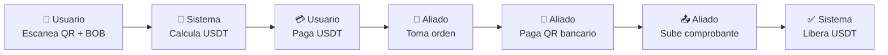

# 📚 Kibo App

Kibo permite a usuarios pagar cualquier QR de transferencia bancaria tradicional (fiat) usando criptomonedas como USDT, a través de una red de aliados P2P que actúan como puente entre el mundo crypto y el sistema bancario.

## 📋 **Índice de Documentación**

### **🏗️ Fase 1 - Documentación Core (Imprescindible)**

| Archivo | Descripción | Audiencia |
|---------|-------------|-----------|
| [`01-arquitectura-sistema.md`](./01-arquitectura-sistema.md) | Vista general del sistema, componentes y stack tecnológico | Todo el equipo |
| [`02-estados-y-flujos.md`](./02-estados-y-flujos.md) | State machine de órdenes y flujos de proceso por actor | Developers + QA |
| [`03-modelo-datos.md`](./03-modelo-datos.md) | Esquema completo de base de datos y relaciones | Backend Dev |
| [`04-navegacion-ux.md`](./04-navegacion-ux.md) | Mapas de navegación y experiencia de usuario | Frontend Dev + UX |
| [`05-casos-uso.md`](./05-casos-uso.md) | User stories detalladas y plan de sprints | Product Owner + Todo el equipo |

## 🚀 **Stack Tecnológico**

- **Frontend**: Next.js 14 + Tailwind CSS
- **Backend**: Next.js API Routes (serverless)
- **Base de Datos**: Supabase (PostgreSQL)
- **Autenticación**: Privy (wallet connect)
- **Storage**: Supabase Storage
- **Realtime**: Supabase Realtime
- **Deployment**: Vercel
- **Blockchain**: Polygon (USDT)

## 🔄 **Flujo Principal del MVP**

## ⏰ **Timeouts del Sistema**

| Estado | Timeout | Acción al Expirar |
|--------|---------|-------------------|
| PENDING_PAYMENT | 3 min | Eliminar orden |
| AVAILABLE | 5 min | Refund automático |
| TAKEN | 5 min | Refund + penalizar aliado |

## 🎯 **MVP - Alcance Inicial**

### **✅ Incluido en MVP**
- ✅ Soporte Bolivia (BOB) + USDT/Polygon
- ✅ Escrow centralizado en backend
- ✅ Verificación automática de comprobantes (sin admin)
- ✅ Timeouts automáticos y refunds
- ✅ Dashboard básico para cada tipo de usuario
- ✅ Sistema de penalizaciones para aliados

### **❌ No Incluido en MVP**
- ❌ Verificación manual de comprobantes
- ❌ Múltiples países/monedas
- ❌ OCR de comprobantes
- ❌ Sistema de reputación complejo
- ❌ Smart contracts descentralizados
- ❌ App móvil nativa

## 📊 **Plan de Desarrollo**

| Sprint | Duración | Objetivo | Entregable |
|--------|----------|----------|------------|
| **Sprint 1** | 2 semanas | Core Usuario | Usuario puede pagar órdenes |
| **Sprint 2** | 2 semanas | Core Aliado | Flujo completo funcional |
| **Sprint 3** | 2 semanas | Sistema Robusto | Timeouts y refunds automáticos |
| **Sprint 4** | 1 semana | Admin + Polish | MVP production-ready |

## 🔧 **Cómo Usar Esta Documentación**

### **Para Desarrolladores**
1. Leer **01-arquitectura-sistema.md** para entender el big picture
2. Revisar **02-estados-y-flujos.md** para entender la lógica de negocio
3. Estudiar **03-modelo-datos.md** para el diseño de BD
4. Implementar según **05-casos-uso.md** (user stories priorizadas)

### **Para Product Owner**
1. Enfocarse en **05-casos-uso.md** para criterios de aceptación
2. Usar **04-navegacion-ux.md** para validar experiencia de usuario
3. Seguir el plan de sprints definido

### **Para QA**
1. **05-casos-uso.md** contiene todos los criterios testeable
2. **02-estados-y-flujos.md** define las transiciones de estado a probar
3. **04-navegacion-ux.md** mapea los flujos de usuario a validar

## 🚨 **Consideraciones Importantes**

### **Seguridad MVP**
- **Escrow centralizado**: Fondos custodiados en wallet controlada por backend
- **Sin verificación admin**: Comprobante subido = aprobación automática
- **Timeouts agresivos**: Previenen fondos bloqueados
- **Logs completos**: Auditoría de todas las acciones

### **Escalabilidad Futura**
- **Arquitectura modular**: Fácil migración a microservicios
- **BD normalizada**: Soporte para múltiples países/tokens
- **Configuración dinámica**: Timeouts ajustables sin redeploy

### **UX Críticos**
- **Mobile-first**: Todas las pantallas optimizadas para móvil
- **Timeouts visibles**: Countdown timers en tiempo real
- **Estados claros**: Usuario siempre sabe qué está pasando
- **Notificaciones**: Updates automáticos de estado

---

**📞 Contacto del Proyecto**  
Para dudas sobre esta documentación o el proyecto Kibo, contactar al equipo de desarrollo.

**📄 Licencia**  
Esta documentación es privada y confidencial del proyecto Kibo.
