# 📚 Kibo App

Kibo allows users to pay any traditional bank transfer QR (fiat) using cryptocurrencies like USDT, through a P2P network of partners who act as a bridge between the crypto world and the banking system.

## 📋 **Documentation Index**

### **🗷️ Phase 1 - Core Documentation (Essential)**

| File                                                       | Description                                    | Audience                    |
| ---------------------------------------------------------- | ---------------------------------------------- | --------------------------- |
| [`01-system-architecture.md`](./01-system-architecture.md) | System overview, components, and tech stack    | Entire team                 |
| [`02-states-and-flows.md`](./02-states-and-flows.md)       | Order state machine and process flows by actor | Developers + QA             |
| [`03-data-model.md`](./03-data-model.md)                   | Complete database schema and relationships     | Backend Dev                 |
| [`04-navigation-ux.md`](./04-navigation-ux.md)             | Navigation maps and user experience            | Frontend Dev + UX           |
| [`05-use-cases.md`](./05-use-cases.md)                     | Detailed user stories and sprint plan          | Product Owner + Entire team |

## 🚀 **Tech Stack**

* **Frontend**: Next.js 14 + Tailwind CSS
* **Backend**: Next.js API Routes (serverless)
* **Database**: Supabase (PostgreSQL)
* **Authentication**: Privy (wallet connect)
* **Storage**: Supabase Storage
* **Realtime**: Supabase Realtime
* **Deployment**: Vercel
* **Blockchain**: Mantle (USDT)

## 🔄 **Main MVP Flow**

```mermaid
graph LR
    A[👤 User<br/>Scans QR + BOB] --> B[🚱 System<br/>Calculates USDT]
    B --> C[💳 User<br/>Pays USDT]
    C --> D[🤝 Partner<br/>Takes order]
    D --> E[🏦 Partner<br/>Pays bank QR]
    E --> F[📄 Partner<br/>Uploads receipt]
    F --> G[✅ System<br/>Releases USDT]
```

## ⏰ **System Timeouts**

| State            | Timeout | Action on Expiration      |
| ---------------- | ------- | ------------------------- |
| PENDING\_PAYMENT | 3 min   | Delete order              |
| AVAILABLE        | 5 min   | Automatic refund          |
| TAKEN            | 5 min   | Refund + penalize partner |

## 🎯 **MVP - Initial Scope**

### **✅ Included in MVP**

* ✅ Support for Bolivia (BOB) + USDT/Mantle
* ✅ Centralized escrow on backend
* ✅ Automatic receipt verification (no admin)
* ✅ Automatic timeouts and refunds
* ✅ Basic dashboard for each user type
* ✅ Penalty system for partners

### **❌ Not Included in MVP**

* ❌ Manual receipt verification
* ❌ Multiple countries/currencies
* ❌ OCR for receipts
* ❌ Complex reputation system
* ❌ Decentralized smart contracts
* ❌ Native mobile app

## 📊 **Development Plan**

| Sprint       | Duration | Goal           | Deliverable                    |
| ------------ | -------- | -------------- | ------------------------------ |
| **Sprint 1** | 2 weeks  | User Core      | User can pay orders            |
| **Sprint 2** | 2 weeks  | Partner Core   | Fully functional flow          |
| **Sprint 3** | 2 weeks  | Robust System  | Automatic timeouts and refunds |
| **Sprint 4** | 1 week   | Admin + Polish | Production-ready MVP           |

## 🔧 **How to Use This Documentation**

### **For Developers**

1. Read **01-system-architecture.md** to understand the big picture
2. Review **02-states-and-flows.md** to understand business logic
3. Study **03-data-model.md** for database design
4. Implement according to **05-use-cases.md** (prioritized user stories)

### **For Product Owner**

1. Focus on **05-use-cases.md** for acceptance criteria
2. Use **04-navigation-ux.md** to validate user experience
3. Follow the defined sprint plan

### **For QA**

1. **05-use-cases.md** contains all testable criteria
2. **02-states-and-flows.md** defines state transitions to test
3. **04-navigation-ux.md** maps user flows to validate

## 🚨 **Important Considerations**

### **MVP Security**

* **Centralized escrow**: Funds are held in a wallet controlled by the backend
* **No admin verification**: Receipt upload = automatic approval
* **Aggressive timeouts**: Prevents locked funds
* **Full logs**: Action audit trail

### **Future Scalability**

* **Modular architecture**: Easy migration to microservices
* **Normalized DB**: Supports multiple countries/tokens
* **Dynamic configuration**: Adjustable timeouts without redeploy

### **Critical UX**

* **Mobile-first**: All screens optimized for mobile
* **Visible timeouts**: Real-time countdown timers
* **Clear states**: Users always know what's happening
* **Notifications**: Automatic status updates

---

**📞 Project Contact**
For questions about this documentation or the Kibo project, contact the development team.

**📄 License**
This documentation is private and confidential for the Kibo project.
